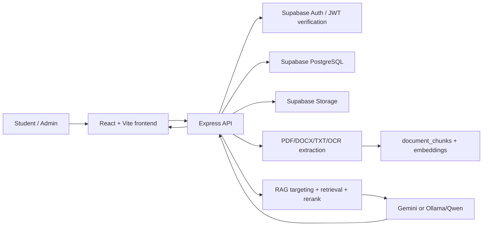
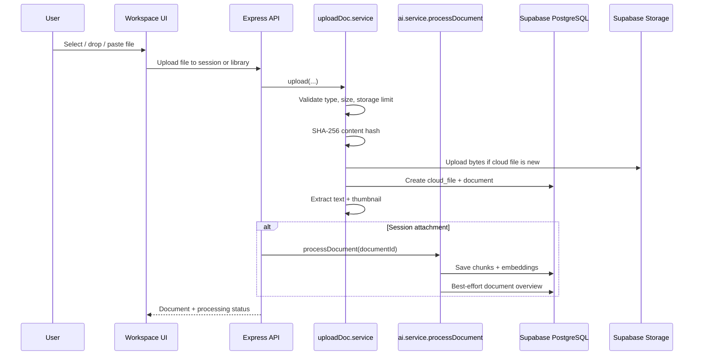
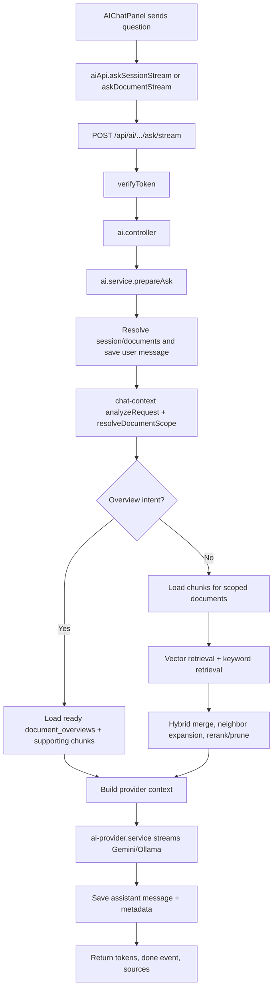
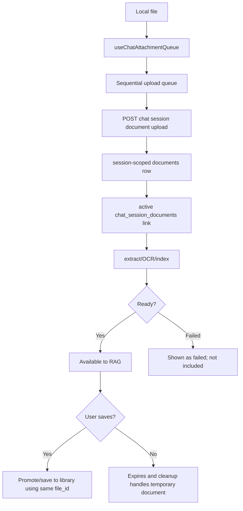
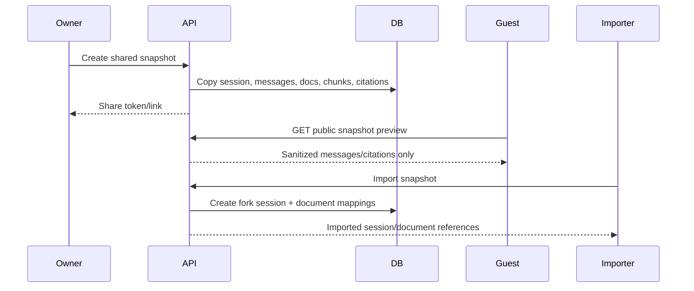

# AI Study Hub - ASM2 System Flow And Code Guide

This guide explains the current AI Study Hub implementation from the actual codebase. It is written for presentation, code tracing, and team onboarding. It does not describe planned features as if they already exist.

## 1. System Overview

AI Study Hub is a React/Vite + Express MVC application backed by Supabase PostgreSQL and Supabase Storage. The system stores study documents, extracts text, chunks and embeds content, supports temporary chat-session attachments, and answers questions through a RAG pipeline using Gemini or Ollama/Qwen.



Key runtime areas:

- Frontend routing and auth: `frontend/src/App.jsx`, `frontend/src/contexts/AuthContext.jsx`, `frontend/src/services/api.js`
- Workspace UI: `frontend/src/pages/WorkspacePage.jsx`, `frontend/src/components/workspace/*`
- Backend API entrypoint: `backend/src/app.js`
- AI routes/controllers/services: `backend/src/routes/ai.routes.js`, `backend/src/controllers/ai.controller.js`, `backend/src/services/ai.service.js`
- Storage/database integration: `backend/src/config/supabase.js`, `backend/src/services/supabase.service.js`, `backend/src/models/*`

## 2. Main Source-Code Map

| Area | Main files | Main functions/classes | What to explain in a demo |
|---|---|---|---|
| Frontend route shell | `frontend/src/App.jsx` | route definitions for `/`, `/login`, `/dashboard`, `/workspace`, `/shared/chat/:token` | Public, protected, admin, workspace, and shared-preview routes are separated. |
| Auth context | `frontend/src/contexts/AuthContext.jsx` | `AuthProvider`, `loadCurrentUser`, `hydrateFromSession`, `login`, `register`, `logout` | Supabase session is hydrated and app user profile is fetched through `/auth/me`. |
| Axios API client | `frontend/src/services/api.js` | request/response interceptors | Adds bearer token and handles safer 401 retry/logout behavior. |
| Workspace page | `frontend/src/pages/WorkspacePage.jsx` | `loadWorkspaceDocuments`, `loadChatHistory`, `handleAsk`, `handleUploadAttachment`, `selectDocument` | Owns workspace state and passes props to sidebar, viewer, and chat panel. |
| Workspace sidebar/viewer | `frontend/src/components/workspace/DocumentSidebar.jsx`, `frontend/src/components/workspace/DocumentViewer.jsx` | presentational components | Lists documents and shows selected document preview/viewer state. |
| AI chat UI | `frontend/src/components/workspace/AIChatPanel.jsx` | `MessageBubble`, `SourceList`, `ModelMenu`, `CompactInput` | Sends questions, streams tokens/status, shows model/mode, timestamps, and sources. |
| Attachment queue | `frontend/src/hooks/useChatAttachmentQueue.js` | queue state, sequential upload, retry, abort | Drag/drop, paste, and picker uploads reuse the same session attachment queue. |
| Attachment UI | `frontend/src/components/workspace/ChatAttachmentBar.jsx` | local and persisted attachment rendering | Shows file status, type icons, image thumbnails, retry/remove/save actions. |
| AI frontend API | `frontend/src/services/aiApi.js` | `askSessionStream`, `askDocumentStream`, `askSession`, `processDocumentForAi`, `getAiUsage` | Uses `fetch` for SSE streaming and Axios for non-stream calls. |
| Chat frontend API | `frontend/src/services/chatApi.js` | session, message, attachment, snapshot API helpers | Loads chat sessions/history and manages session documents/sharing. |
| Upload frontend API | `frontend/src/services/uploadDocApi.js` | `uploadDocument`, `validateUploadDocFile` | Client-side max file size is 50 MB and supported types mirror backend. |
| Backend app | `backend/src/app.js` | route mounting | Mounts auth, documents, dashboard, AI, workspace, chat, public, and admin APIs. |
| Backend auth | `backend/src/middleware/auth.js` | `verifyToken` | Validates bearer token with Supabase and syncs local user profile. |
| Upload route | `backend/src/routes/uploadDoc.routes.js`, `backend/src/controllers/uploadDoc.controller.js` | upload endpoint/controller | Receives library uploads through memory-based Multer. |
| Upload service | `backend/src/services/uploadDoc.service.js` | `upload`, `applyExtraction` | Computes content hash, reuses cloud files, stores document rows, extracts text, thumbnails. |
| Upload middleware | `backend/src/middleware/upload.js` | Multer memory storage | Accepts PDF, DOCX, TXT, PNG, JPEG, TIFF, BMP up to 50 MB. |
| Extraction | `backend/src/services/document-text.service.js` | `extractTextFromBuffer`, `extractPdfText`, `extractImageText` | PDF uses `pdf-parse` first, OCR fallback for scanned PDFs/images, DOCX uses `mammoth`, TXT uses UTF-8. |
| OCR | `backend/src/services/ocr.service.js` | OCR helpers | External OCR pipeline for scanned PDFs/images. |
| PDF service | `backend/src/services/pdf.service.js` | `extractText` | PDF text extraction support. |
| Chunking/RAG helpers | `backend/src/services/rag.service.js` | `splitTextIntoChunks`, `retrieveRelevantChunks`, `buildSourcePayload` | Chunk size 1600 chars, overlap 220, max context 7000 chars. |
| Embeddings | `backend/src/services/embedding.service.js` | `embedQuery`, `embedChunks`, `embedTexts` | Gemini embedding path for chunk/query vectors. |
| Chunk model | `backend/src/models/document-chunk.model.js` | `replaceForDocument`, `findByDocumentId`, `matchByEmbedding`, `matchByEmbeddingAcrossDocuments` | Persists chunks and vector search results. |
| Overview generation | `backend/src/services/document-overview.service.js` | `selectRepresentativeChunks`, `generateOverviewBestEffort`, `retryOverview` | Best-effort persisted summaries for overview/comparison questions. |
| AI orchestration | `backend/src/services/ai.service.js` | `processDocument`, `prepareAsk`, `executeAsk`, `executeAskStream`, `askSessionStream` | Main RAG pipeline for document/session Q&A. |
| Targeting/context | `backend/src/services/chat-context.service.js` | `analyzeRequest`, `resolveDocumentScope` | Resolves explicit files, image questions, comparisons, and general session scope. |
| Neighbor expansion | `backend/src/services/rag-neighbor.service.js` | `expandWithNeighborsSafe` | Adds adjacent chunks where useful without changing the original source model. |
| Reranking | `backend/src/services/rag-rerank.service.js` | `rerankAndPruneSafe` | Prunes and reorders evidence before provider prompt construction. |
| Comparison RAG | `backend/src/services/rag-comparison.service.js` | `retrieveComparisonEvidence`, `buildGroundedProviderAnswer` | Handles multi-document comparison evidence and guarded comparison answers. |
| Provider selection | `backend/src/config/ai-providers.js`, `backend/src/services/ai-provider.service.js` | `resolveModelSelection`, `generateAnswer`, `streamAnswer` | Routes requests to Gemini or Ollama and builds provider prompts. |
| Gemini provider | `backend/src/services/gemini.service.js` | generation and streaming calls | Gemini chat and streaming integration. |
| Ollama provider | `backend/src/services/ollama.service.js` | chat, stream, model status | Local Qwen/Ollama integration. |
| Usage tracking | `backend/src/services/ai-usage.service.js`, `backend/src/models/ai-usage.model.js` | quota/status/logging helpers | Tracks provider/model usage where applicable. |
| Chat persistence | `backend/src/models/chat.model.js`, `backend/src/services/chat.service.js` | sessions, messages, attachments | Stores user/assistant messages and assistant metadata. |
| Citations | `backend/src/services/rag.service.js`, `backend/src/services/ai.service.js` | `buildSourcePayload`, assistant metadata | Sources are built from final evidence chunks, not model-generated citations. |
| Session attachments | `backend/src/services/session-attachment.service.js` | `uploadSessionDocument`, `processSessionDocument`, `saveToLibrary`, `reprocessSessionDocument` | Creates temporary session docs, processes them, and supports save/remove/retry. |
| Sharing/snapshots | `backend/src/services/chat-snapshot.service.js`, `backend/src/routes/public.routes.js` | `createSnapshot`, `getPublicPreview`, `importSnapshot`, `saveSharedDocumentToLibrary` | Immutable shared chat snapshots, anonymous sanitized preview, import forks. |
| Dashboard | `frontend/src/pages/DashboardPage.jsx`, `backend/src/services/dashboard.service.js` | `getDashboardData` | User dashboard storage, counts, recent docs, subjects. |
| Admin | `frontend/src/pages/AdminPage.jsx`, `backend/src/services/admin.service.js` | `getOverview`, `listUsers`, `listDocuments` | Admin overview metrics and moderation/management surfaces. |

## 3. Document Upload And Processing Flow

There are two related but different flows.

### 3.1 Library upload

1. User selects a file in the frontend.
2. `frontend/src/services/uploadDocApi.js` validates file type/size and calls the upload API.
3. Backend route/controller calls `backend/src/services/uploadDoc.service.js`.
4. `uploadDoc.service.upload()`:
   - validates user/storage limit;
   - calculates SHA-256 content hash;
   - reuses an existing `cloud_files` row when safe;
   - uploads to Supabase Storage only when the physical file is new;
   - creates a `documents` row;
   - generates/reuses thumbnail metadata;
   - extracts text through `document-text.service.js`;
   - copies chunks from a ready duplicate source when possible;
   - stores tags/activity/notifications.

Library upload stores extracted text and thumbnail data. Full AI chunking/embedding is performed later when the document is processed for AI, unless chunks were copied from an existing ready document.

### 3.2 Session attachment upload

Temporary chat attachments use the same upload service but immediately run AI processing:

1. `AIChatPanel.jsx` / `ChatAttachmentBar.jsx` / `useChatAttachmentQueue.js` submits a file.
2. `frontend/src/services/chatApi.js` sends the session upload request with `uploadRequestId`.
3. `backend/src/services/session-attachment.service.js` creates a session-scoped document with `expires_at`.
4. `session-attachment.service.processSessionDocument()` calls `ai.service.processDocument()`.
5. `ai.service.processDocument()` extracts text if needed, chunks the text, embeds chunks, saves chunks, and best-effort generates the document overview.
6. The response includes `attachmentProcessing` with extraction/indexing readiness.



### File type differences

| Type | Extraction path | Notes |
|---|---|---|
| PDF | `pdf.service.extractText()` through `pdf-parse`; OCR fallback in `document-text.service.extractPdfText()` | Scanned PDFs can become `empty` if OCR cannot extract useful text. |
| DOCX | `mammoth.extractRawText()` in `extractDocxText()` | Extracts raw text, not rich layout. |
| TXT | `buffer.toString('utf8')` | Plain UTF-8 text. |
| Image | `ocr.service.extractImageText()` through `extractImageText()` | OCR text only. The current system does not understand objects, diagrams, charts, or visual layout without readable OCR text. |

Failure behavior:

- Unsupported type/oversize files are rejected by `backend/src/middleware/upload.js` and frontend validation.
- Empty extraction sets extraction status to `empty` with an error message.
- Embedding failure does not block chunks; keyword RAG can still work if chunks exist.
- Overview generation is best-effort and must not fail upload or processing.

## 4. RAG Chatbot Flow

The current system is best described as **Adaptive overview-aware RAG + document targeting + neighbor expansion + reranking**. It is **not full hierarchical RAG** yet, because sections are not persisted as independent retrievable nodes with section-level embeddings.

### End-to-end request flow



### Important call order

1. Frontend:
   - `frontend/src/components/workspace/AIChatPanel.jsx` calls `onAsk`.
   - `WorkspacePage.jsx` chooses `askSessionStream()` or non-stream fallback.
   - `frontend/src/services/aiApi.js` uses `fetch` for SSE streaming.
2. Backend:
   - `backend/src/routes/ai.routes.js` maps `/chat/sessions/:sessionId/ask/stream` and `/documents/:id/ask/stream`.
   - `backend/src/middleware/auth.js` verifies token.
   - `backend/src/controllers/ai.controller.js` calls AI service.
   - `backend/src/services/ai.service.js` runs `prepareAsk()` then `executeAskStream()`.
3. RAG:
   - `chat-context.service.analyzeRequest()` and `resolveDocumentScope()` classify targeting/comparison/image/overview behavior.
   - `documentChunkModel.matchByEmbedding()` or `matchByEmbeddingAcrossDocuments()` performs vector search.
   - `ragService.retrieveRelevantChunks()` performs keyword retrieval and first-chunk fallback.
   - `mergeHybridChunks()` combines vector and keyword scores with 0.7 vector / 0.3 keyword weighting.
   - `rag-neighbor.service.expandWithNeighborsSafe()` adds adjacent chunks.
   - `rag-rerank.service.rerankAndPruneSafe()` prunes evidence.
4. Provider:
   - `ai-provider.service.buildRagPrompts()` builds the prompt.
   - `gemini.service` or `ollama.service` generates/streams the answer.
5. Persistence:
   - `chat.model.addMessage()` stores assistant text and `metadata`.
   - Metadata includes model/provider/mode/sources/retrieval details so history reload can display citations.

### Current retrieval limits

| Limit | Location | Value / behavior |
|---|---|---|
| Chunk size | `backend/src/services/rag.service.js` | `CHUNK_SIZE = 1600` characters |
| Chunk overlap | `backend/src/services/rag.service.js` | `CHUNK_OVERLAP = 220` characters |
| Max context | `backend/src/services/rag.service.js` | `MAX_CONTEXT_CHARS = 7000` |
| Fallback chunks | `backend/src/services/rag.service.js` | `FALLBACK_CHUNK_LIMIT = 2` |
| Final normal RAG count | `backend/src/services/ai.service.js` | `RAG_CONTEXT_LIMIT = 4` |
| Explicit scope candidates | `backend/src/services/ai.service.js` | `EXPLICIT_SCOPE_CANDIDATE_LIMIT = 6` |
| General scope candidates | `backend/src/services/ai.service.js` | `GENERAL_SCOPE_CANDIDATE_LIMIT = 12` |
| Question length | `backend/src/services/ai.service.js` | `MAX_QUESTION_CHARS = 2000` |
| Session document limit | `backend/src/services/session-attachment.service.js` | 1 primary + 19 attachments = 20 active session documents |

## 5. Query-Type Behavior

| User query type | Example | Scope behavior | Evidence behavior | Answer behavior |
|---|---|---|---|---|
| Explicit single document | "What does Order.pdf say about invoices?" | Restrict or strongly prioritize resolved document | Chunks from that document only unless comparison requested | Answer from selected file. |
| General session question | "What should I study?" | Search active session documents | Strongest evidence globally, bounded by context | Answer with available sources. |
| Overview question | "What is this file about?", "file này nói về gì" | Resolve target document | Use ready `document_overviews` plus 1-2 real source chunks; fallback to normal chunks if overview missing | Summarize purpose/topics without citing overview row directly. |
| Multi-document comparison | "Are file A and file B related?" | Restrict to explicitly requested documents | Preserve coverage from each requested document when possible | Compare topics/purpose/similarities/differences and state unrelated when supported. |
| Broad synthesis | "Summarize all attached files" | Search active documents | Bounded per-document candidates plus reranking | Summarize without expanding global top-K blindly. |
| Image OCR text question | "hình ảnh tôi vừa gửi viết gì", "what does the image say?" | Latest/specified image only | OCR chunks from targeted image only | Answer from OCR text; do not claim visual analysis is available. |
| Image visual question | "trong ảnh có vật gì", "what objects are in the image?" | Latest/specified image only | No unrelated fallback | Return OCR-only limitation; no object/layout/chart understanding yet. |
| Document-only mode | Any | Same retrieval as query type | Same sources | Provider must answer only from supplied chunks/context. |
| Hybrid mode | Any | Same retrieval as query type | Same sources | May add general study explanation only when clearly separated from document evidence. |

## 6. Chat Attachment Flow

Files added by picker, drag/drop, or clipboard paste all reuse the same temporary session attachment model.



Key implementation files:

- Queue: `frontend/src/hooks/useChatAttachmentQueue.js`
- UI: `frontend/src/components/workspace/ChatAttachmentBar.jsx`, `frontend/src/components/workspace/AIChatPanel.jsx`
- API: `frontend/src/services/chatApi.js`
- Backend: `backend/src/services/session-attachment.service.js`
- Upload/extraction: `backend/src/services/uploadDoc.service.js`, `backend/src/services/document-text.service.js`

Important behaviors:

- Queue statuses: `queued`, `uploading`, `processing`, `complete`, `failed`.
- `uploadRequestId` makes retry/idempotent upload safe for the same session request.
- Local duplicate prevention uses `name + size + lastModified + type`; real physical deduplication uses backend SHA-256 content hash.
- Pending items reserve capacity; failed/removed local items do not.
- Send is disabled while queued/uploading/processing items exist.
- Remove/cancel aborts local work; if the server attachment exists, the detach/remove flow is called.
- Temporary session documents expire through lifecycle logic; active links do not pin temporary files forever.
- Save to My Documents reuses `file_id`, storage object, extracted text, chunks, embeddings, and thumbnails where supported.
- Images are OCR-only in this phase. The system can answer text written in an image if OCR succeeded, but cannot understand objects, diagrams, charts, or non-text visual layout.

## 7. Shared Chat Session Flow

Shared chats are immutable snapshots, not live database sessions exposed directly to anonymous users.



Core files:

- Backend service: `backend/src/services/chat-snapshot.service.js`
- Authenticated routes: `backend/src/routes/chat.routes.js`
- Public preview routes: `backend/src/routes/public.routes.js`
- Frontend preview: `frontend/src/pages/SharedChatSnapshotPage.jsx`
- Frontend shared dashboard: `frontend/src/pages/SharedPage.jsx`

Important security behavior:

- Public preview does not expose full chunk content, embeddings, storage paths, hashes, live IDs, or signed URLs.
- Public citations use sanitized short excerpts.
- Internal assistant metadata is reduced to display-safe fields.
- Import uses server-side snapshot data, not the reduced public payload.
- Imported sessions are forked. Imported shared documents can be used for RAG only through the imported session and active attachment relation.
- Save/download/import actions require authentication.

Shared and saved library documents reuse file-level assets:

- Same `file_id` / `cloud_files` row when possible.
- Thumbnails are resolved by file/document reuse instead of duplicated per document.
- Snapshot lifecycle pins remain separate from temporary attachment cleanup.

## 8. Dashboard And Data Setup Workflows

### 8.1 Data setup workflow

Actor: developer/admin preparing a demo.

1. Run database migrations in order from `backend/db/migrations`.
2. Optional demo seed data comes from:
   - `backend/db/seeds/001_demo_data.sql`
   - `backend/scripts/seed-demo-data.js`
   - seed files under `backend/db/seeds/files`
3. File backfill utilities exist for operational cleanup:
   - `backend/scripts/backfill-content-hashes.js`
   - `backend/scripts/backfill-thumbnails.js`
   - `backend/scripts/run-session-lifecycle.js`

These scripts are setup utilities. They are not part of the normal request path.

### 8.2 Main student dashboard workflow

Actor: logged-in student.

1. Frontend loads `frontend/src/pages/DashboardPage.jsx`.
2. `getDashboardData()` in `frontend/src/services/dashboardApi.js` calls backend dashboard API.
3. `backend/src/services/dashboard.service.js#getDashboardData(userId)` loads:
   - storage limit/used bytes;
   - document count;
   - bookmark count;
   - chat count;
   - recent documents with signed thumbnails;
   - subjects.
4. UI renders dashboard cards and recent document list.

This dashboard does not claim advanced analytics beyond the data returned by `dashboard.service.js`.

### 8.3 Admin dashboard workflow

Actor: logged-in admin.

1. Frontend loads `frontend/src/pages/AdminPage.jsx`.
2. Backend overview comes from `backend/src/services/admin.service.js#getOverview()`.
3. Current metrics include:
   - total users;
   - processed documents;
   - AI query count from user chat messages;
   - extraction/system error count;
   - total storage bytes;
   - last-seven-days user/document charts;
   - top subjects by document count;
   - latest activity logs.

## 9. Real Exception And Edge Cases

| Exception | Where handled | User/system behavior |
|---|---|---|
| Missing/invalid auth token | `backend/src/middleware/auth.js` | Returns `401` with stable auth error code. Frontend may retry session token before redirecting. |
| Unsupported file type | `backend/src/middleware/upload.js`, `uploadDocApi.validateUploadDocFile()` | Rejects anything outside PDF, DOCX, TXT, PNG, JPEG, TIFF, BMP. |
| File too large | `backend/src/middleware/upload.js`, `uploadDocApi.js` | 50 MB limit. |
| No readable text | `document-text.service.js` | Extraction status becomes `empty`; chat returns a friendly limitation instead of unrelated sources. |
| Embedding provider failure | `embedding.service.js`, `ai.service.processDocument()` | Chunks can remain usable through keyword retrieval; embedding status can be failed. |
| Overview generation failure | `document-overview.service.js` | Stores failed overview status; document processing still succeeds. |
| No chunks yet | `ai.service.getOrCreateChunksForAsk()` | `/ask` can auto-process where safe, or returns a clear processing/limitation state. |
| Ambiguous document reference | `chat-context.service.js`, `ai.service.buildAmbiguousDocumentAnswer()` | User is asked to clarify rather than guessing the file. |
| Image visual question | `ai.service.buildImageVisualLimitationAnswer()` | System explains only OCR text is supported, not visual object/layout analysis. |
| Attachment limit exceeded | `session-attachment.service.js`, migration triggers | Enforces 20 active session documents total. |
| Duplicate upload retry | `chat_session_documents.upload_request_id` | Same session/request ID returns existing attachment. |
| Expired temporary attachment | lifecycle migrations/scripts | Temporary session document can expire and be soft-removed unless saved/pinned elsewhere. |
| Public shared preview | `chat-snapshot.service.js` | Sanitizes response and avoids protected app bootstrap. |

## 10. Database And Migration Map

| Migration | Important structures |
|---|---|
| `001_initial_schema.sql` | `users`, `subjects`, `cloud_files`, `documents`, `tags`, `document_tags`, `bookmarks`, `chat_sessions`, `chat_messages`, `doc_shares`, `notifications`, `activity_logs` |
| `009_document_chunks.sql` | `document_chunks` and text-search support |
| `012_document_chunk_embeddings.sql` | `vector` extension, `document_chunks.embedding`, embedding metadata, `match_document_chunks` RPC |
| `013_chat_message_metadata.sql` | `chat_messages.metadata JSONB` for provider/model/sources |
| `014_document_extraction_metadata.sql` | extraction metadata on documents |
| `015_session_document_lifecycle.sql` | temporary session document lifecycle foundations |
| `016_cloud_file_content_hash.sql` | content hash reuse and chunk-copy helpers |
| `017_multi_document_session_rag.sql` | multi-document session RAG structures/functions |
| `018_chat_session_management.sql` | chat session management improvements |
| `019_chat_session_primary_document.sql` | primary document on chat sessions |
| `020_session_document_cleanup.sql` | cleanup/recovery lifecycle |
| `021_public_documents_features.sql` | public document/catalog features |
| `022_immutable_chat_snapshots.sql` | immutable snapshot tables, snapshot documents/chunks/messages/citations/imports/provenance |
| `023_file_level_thumbnail_reuse.sql` | file-level thumbnail reuse |
| `024_shared_link_access_state.sql` | shared link access state |
| `025_shared_snapshot_recipients.sql` | shared snapshot recipient tracking |
| `026_chat_attachment_drag_drop.sql` | upload request idempotency, processing claims, 20-document session limit |
| `027_session_lifecycle_and_bulk_attachment_cleanup.sql` | lifecycle/bulk cleanup refinements |
| `028_recoverable_attachment_permanent_removal.sql` | recoverable attachment removal |
| `029_document_overviews.sql` | `document_overviews` table for persisted summaries/type/purpose/topics/outline |

Important current tables:

- `documents`: logical document rows, scope/lifecycle/extraction/thumbnail fields.
- `cloud_files`: physical stored file metadata and content hash.
- `document_chunks`: chunk content, order, metadata, embedding fields.
- `document_overviews`: lightweight generated overview per document.
- `chat_sessions`: user chat sessions.
- `chat_messages`: persisted user/assistant messages with JSON metadata.
- `chat_session_documents`: documents attached to a chat session.
- Snapshot tables from migration `022`: immutable public/shared chat representation.

## 11. Demo Code References

Use these files during a code walkthrough:

- `frontend/src/pages/WorkspacePage.jsx` - shows how document selection, chat history, streaming, and attachments are coordinated.
- `frontend/src/components/workspace/AIChatPanel.jsx` - the chat UI: question box, streaming messages, model selection, sources, paste/drag/drop.
- `frontend/src/hooks/useChatAttachmentQueue.js` - sequential upload queue, retry, duplicate local event prevention, abort behavior.
- `frontend/src/components/workspace/ChatAttachmentBar.jsx` - persisted and pending attachment chips, image thumbnail/lightbox behavior.
- `frontend/src/services/aiApi.js` - streaming request parser and normal ask fallback.
- `frontend/src/services/chatApi.js` - chat session, attachment, and snapshot API functions.
- `backend/src/routes/ai.routes.js` - all AI endpoints in one place.
- `backend/src/services/ai.service.js` - best single backend file to explain the RAG pipeline.
- `backend/src/services/chat-context.service.js` - document targeting and query classification.
- `backend/src/services/rag.service.js` - chunking, keyword retrieval, context budget, source payload.
- `backend/src/services/document-text.service.js` - PDF/DOCX/TXT/image extraction behavior.
- `backend/src/services/session-attachment.service.js` - temporary attachment lifecycle and processing.
- `backend/src/services/document-overview.service.js` - persisted overview generation and same-file reuse.
- `backend/src/services/ai-provider.service.js` - provider-neutral prompt/generation path.
- `backend/src/services/chat-snapshot.service.js` - share/import/save behavior and public sanitization.
- `backend/src/services/dashboard.service.js` - student dashboard data contract.
- `backend/src/services/admin.service.js` - admin dashboard overview metrics.

## 12. Testing Evidence

Backend tests use Node's built-in test runner through:

```bash
cd backend
npm test
```

Important backend test suites include:

- `backend/test/ai-attachment-regression.test.js`
- `backend/test/ai-document-targeting.test.js`
- `backend/test/ai-session-shared-access.test.js`
- `backend/test/chat-comparison.test.js`
- `backend/test/chat-snapshot-sharing.test.js`
- `backend/test/document-overview.test.js`
- `backend/test/rag-neighbor.test.js`
- `backend/test/rag-rerank.test.js`
- `backend/test/session-document-lifecycle.test.js`
- `backend/test/thumbnail-reuse.test.js`

Frontend tests use Vitest/React Testing Library:

```bash
cd frontend
npm test
```

Important frontend test suites include:

- `frontend/src/components/workspace/AIChatPanel.test.jsx`
- `frontend/src/components/workspace/AIChatPanelPaste.test.jsx`
- `frontend/src/components/workspace/ChatAttachmentBar.test.jsx`
- `frontend/src/pages/WorkspacePage.test.jsx`

Build verification:

```bash
cd frontend
npm run build
```

This guide does not claim a fixed test pass count because it changes as tests are added.

## 13. Environment And Deploy Notes

### Frontend

Common frontend variables:

- `VITE_API_URL` - backend API base URL.
- `VITE_SUPABASE_URL`
- `VITE_SUPABASE_ANON_KEY`
- `VITE_SITE_URL` - deployed frontend origin used for OAuth redirects.
- `VITE_CHAT_DRAG_DROP_ATTACHMENTS_ENABLED` - feature flag for drag/drop attachment UI.

SPA deployment requires history fallback/rewrite. On Vercel, direct loads such as `/login`, `/workspace/documents/:documentId`, and `/shared/chat/:token` must rewrite to `index.html`; otherwise the user sees `404 NOT_FOUND` before React Router can render.

### Backend

Common backend variables:

- Supabase URL/service keys and JWT-related auth configuration.
- Gemini API key/model variables for chat and embeddings.
- Ollama variables such as `OLLAMA_BASE_URL`.
- Document renderer paths such as `MUTOOL_PATH`, `LIBREOFFICE_PATH`, and OCR dependencies.
- Overview configuration:
  - `DOCUMENT_OVERVIEW_ENABLED`
  - `DOCUMENT_OVERVIEW_PROVIDER`
  - `DOCUMENT_OVERVIEW_MODEL`
  - `DOCUMENT_OVERVIEW_MAX_CHARS`
  - `DOCUMENT_OVERVIEW_MAX_CHUNKS`

Do not commit secrets. Keep provider keys in backend environment variables only.

### Provider/runtime dependencies

- PDF text extraction: Node service using `pdf-parse`.
- DOCX extraction: `mammoth`.
- PDF/image OCR and thumbnail generation require local tools configured in environment.
- Ollama/Qwen requires a local Ollama server and installed model.
- Gemini requires the configured API key.

## 14. Presenter Cheat Sheet

### 10-15 line system flow

1. User logs in through Supabase-backed auth.
2. React app stores session state in `AuthContext`.
3. User uploads documents or adds session attachments.
4. Backend validates file type/size and computes content hash.
5. Supabase Storage stores the physical file only when new.
6. PostgreSQL stores document and cloud-file metadata.
7. Extraction reads PDF/DOCX/TXT or OCR text from images/scanned PDFs.
8. AI processing splits text into overlapping chunks.
9. Embedding generation stores vector metadata when available.
10. Document overview generation runs best-effort after chunks are saved.
11. User asks a question in workspace chat.
12. Backend resolves document scope, query type, and active session documents.
13. RAG retrieves chunks using vector + keyword, expands neighbors, reranks/prunes.
14. Gemini or Ollama streams the answer back.
15. Assistant message metadata stores model, mode, sources, and retrieval details for reload.

### Five strengths

1. Real document lifecycle instead of only demo-local state.
2. File-level reuse through content hash and `file_id`.
3. Adaptive RAG with targeting, overview support, neighbor expansion, and reranking.
4. Public shared previews are sanitized and immutable.
5. Chat history persists provider/model/sources through message metadata.

### Five limitations

1. Image support is OCR text only, not true visual understanding.
2. Section headings exist as chunk metadata, not independent section nodes.
3. Overview data improves overview/comparison questions but is not full hierarchical retrieval.
4. Keyword fallback can answer without embeddings, but semantic quality is lower.
5. Local Ollama quality depends on installed model and machine resources.

### Likely questions and answers

| Question | Short answer |
|---|---|
| Is this full hierarchical RAG? | No. It is overview-aware adaptive RAG with chunk metadata, but sections are not independent persisted retrieval nodes yet. |
| Are citations generated by the model? | No. Backend attaches citations from final evidence chunks supplied to the model. |
| Can the system understand diagrams in images? | Not yet. It supports OCR text from images, not visual reasoning. |
| Why store `cloud_files` separately from `documents`? | Multiple logical documents can share one physical file and thumbnail without duplicate storage. |
| What happens if embeddings fail? | If chunks exist, keyword retrieval can still answer. |
| Why use snapshots for sharing? | Public links need immutable, sanitized data instead of exposing live private sessions. |
| Does Save to My Documents duplicate the file? | No. It reuses the same file/content where possible. |
| How are temporary attachments cleaned? | They expire through lifecycle logic unless saved or protected by snapshot/file references. |
| Which file is best for explaining RAG? | Start with `backend/src/services/ai.service.js`, then `chat-context.service.js`, `rag.service.js`, and `ai-provider.service.js`. |
| Which files show the frontend workspace? | `WorkspacePage.jsx`, `AIChatPanel.jsx`, `DocumentSidebar.jsx`, `DocumentViewer.jsx`, and `ChatAttachmentBar.jsx`. |

