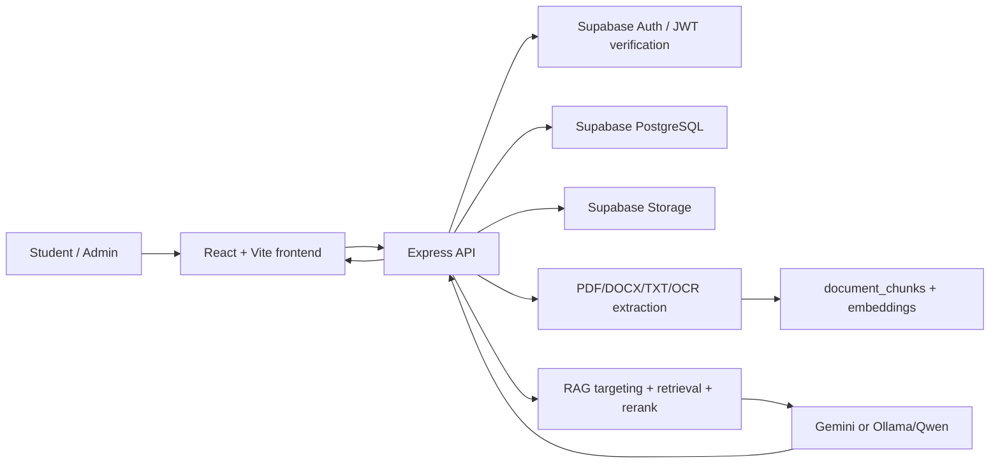
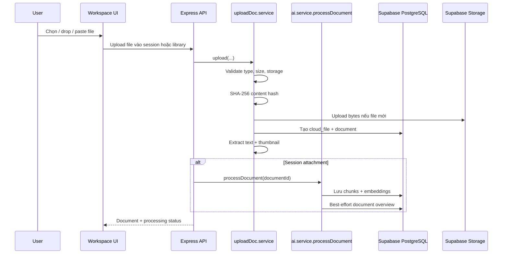
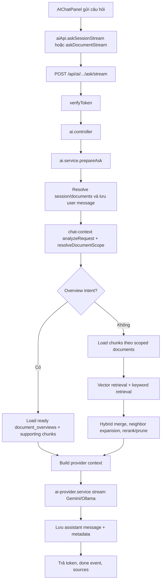
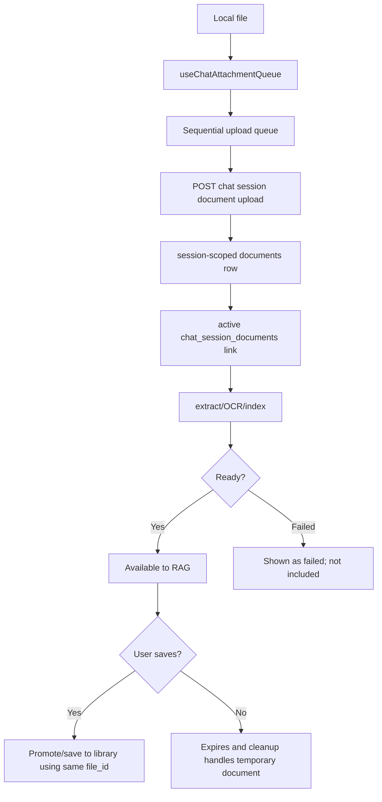
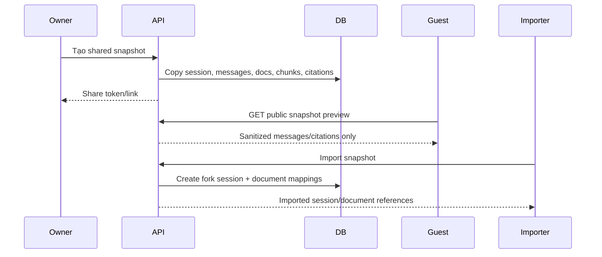

# AI Study Hub - Hướng Dẫn System Flow Và Code Cho ASM2

Tài liệu này là phiên bản tiếng Việt của guide ASM2, viết dựa trên code hiện tại trong repo. Mục tiêu là giúp thuyết trình, trace code, và onboarding thành viên mới. Những phần chưa được hệ thống hỗ trợ đầy đủ sẽ được ghi rõ, không mô tả như tính năng đã hoàn chỉnh.

## 1. Tổng Quan Hệ Thống

AI Study Hub là ứng dụng React/Vite ở frontend, Express MVC ở backend, dùng Supabase PostgreSQL để lưu dữ liệu và Supabase Storage để lưu file. Hệ thống cho phép lưu tài liệu học tập, trích xuất nội dung, chia chunk, tạo embedding, gắn file tạm vào phiên chat, và trả lời câu hỏi bằng RAG thông qua Gemini hoặc Ollama/Qwen.



Các khu vực runtime chính:

- Routing và auth frontend: `frontend/src/App.jsx`, `frontend/src/contexts/AuthContext.jsx`, `frontend/src/services/api.js`
- Workspace UI: `frontend/src/pages/WorkspacePage.jsx`, `frontend/src/components/workspace/*`
- Entry point backend: `backend/src/app.js`
- AI routes/controllers/services: `backend/src/routes/ai.routes.js`, `backend/src/controllers/ai.controller.js`, `backend/src/services/ai.service.js`
- Kết nối Storage/database: `backend/src/config/supabase.js`, `backend/src/services/supabase.service.js`, `backend/src/models/*`

## 2. Bản Đồ Source Code Chính

| Khu vực | File chính | Hàm/class chính | Nên giải thích khi demo |
|---|---|---|---|
| Frontend route shell | `frontend/src/App.jsx` | route cho `/`, `/login`, `/dashboard`, `/workspace`, `/shared/chat/:token` | Tách route public, protected, admin, workspace, shared preview. |
| Auth context | `frontend/src/contexts/AuthContext.jsx` | `AuthProvider`, `loadCurrentUser`, `hydrateFromSession`, `login`, `register`, `logout` | Hydrate Supabase session và lấy app user profile qua `/auth/me`. |
| Axios API client | `frontend/src/services/api.js` | request/response interceptors | Gắn bearer token và xử lý retry/logout khi gặp 401. |
| Workspace page | `frontend/src/pages/WorkspacePage.jsx` | `loadWorkspaceDocuments`, `loadChatHistory`, `handleAsk`, `handleUploadAttachment`, `selectDocument` | Nơi điều phối state workspace, chat history, streaming, attachment. |
| Workspace sidebar/viewer | `frontend/src/components/workspace/DocumentSidebar.jsx`, `DocumentViewer.jsx` | presentational components | Hiển thị list tài liệu và viewer/preview tài liệu được chọn. |
| AI chat UI | `frontend/src/components/workspace/AIChatPanel.jsx` | `MessageBubble`, `SourceList`, `ModelMenu`, `CompactInput` | Gửi câu hỏi, stream token/status, hiện model/mode/timestamp/sources. |
| Attachment queue | `frontend/src/hooks/useChatAttachmentQueue.js` | queue state, upload tuần tự, retry, abort | Drag/drop, paste, file picker đều dùng cùng queue. |
| Attachment UI | `frontend/src/components/workspace/ChatAttachmentBar.jsx` | render attachment local/persisted | Hiện trạng thái file, icon loại file, thumbnail ảnh, retry/remove/save. |
| AI frontend API | `frontend/src/services/aiApi.js` | `askSessionStream`, `askDocumentStream`, `askSession`, `processDocumentForAi`, `getAiUsage` | Dùng `fetch` cho SSE streaming, Axios cho non-stream. |
| Chat frontend API | `frontend/src/services/chatApi.js` | session, message, attachment, snapshot helpers | Load session/history và quản lý tài liệu trong session/share. |
| Upload frontend API | `frontend/src/services/uploadDocApi.js` | `uploadDocument`, `validateUploadDocFile` | Validate file type và giới hạn 50 MB ở client. |
| Backend app | `backend/src/app.js` | route mounting | Mount auth, documents, dashboard, AI, workspace, chat, public, admin APIs. |
| Backend auth | `backend/src/middleware/auth.js` | `verifyToken` | Verify bearer token bằng Supabase và sync local user profile. |
| Upload route/controller | `backend/src/routes/uploadDoc.routes.js`, `backend/src/controllers/uploadDoc.controller.js` | upload endpoint/controller | Nhận library upload qua Multer memory storage. |
| Upload service | `backend/src/services/uploadDoc.service.js` | `upload`, `applyExtraction` | Hash nội dung, tái sử dụng cloud file, tạo document, extract text, thumbnail. |
| Upload middleware | `backend/src/middleware/upload.js` | Multer memory storage | Chấp nhận PDF, DOCX, TXT, PNG, JPEG, TIFF, BMP tối đa 50 MB. |
| Extraction | `backend/src/services/document-text.service.js` | `extractTextFromBuffer`, `extractPdfText`, `extractImageText` | PDF dùng `pdf-parse`, scanned PDF/image dùng OCR, DOCX dùng `mammoth`, TXT dùng UTF-8. |
| Chunking/RAG | `backend/src/services/rag.service.js` | `splitTextIntoChunks`, `retrieveRelevantChunks`, `buildSourcePayload` | Chunk 1600 ký tự, overlap 220, context tối đa 7000 ký tự. |
| Embeddings | `backend/src/services/embedding.service.js` | `embedQuery`, `embedChunks`, `embedTexts` | Tạo vector cho chunk/query bằng Gemini embedding. |
| Chunk model | `backend/src/models/document-chunk.model.js` | `replaceForDocument`, `findByDocumentId`, `matchByEmbedding`, `matchByEmbeddingAcrossDocuments` | Lưu chunks và query vector search. |
| Overview generation | `backend/src/services/document-overview.service.js` | `selectRepresentativeChunks`, `generateOverviewBestEffort`, `retryOverview` | Tạo overview best-effort cho câu hỏi tổng quan/so sánh. |
| AI orchestration | `backend/src/services/ai.service.js` | `processDocument`, `prepareAsk`, `executeAsk`, `executeAskStream`, `askSessionStream` | Pipeline RAG chính. |
| Targeting/context | `backend/src/services/chat-context.service.js` | `analyzeRequest`, `resolveDocumentScope` | Resolve file được hỏi, ảnh, comparison, overview, general session scope. |
| Neighbor expansion | `backend/src/services/rag-neighbor.service.js` | `expandWithNeighborsSafe` | Thêm chunk liền kề khi hữu ích. |
| Reranking | `backend/src/services/rag-rerank.service.js` | `rerankAndPruneSafe` | Sắp xếp và prune evidence trước khi gửi model. |
| Comparison RAG | `backend/src/services/rag-comparison.service.js` | `retrieveComparisonEvidence`, `buildGroundedProviderAnswer` | Evidence cho so sánh nhiều tài liệu. |
| Provider selection | `backend/src/config/ai-providers.js`, `backend/src/services/ai-provider.service.js` | `resolveModelSelection`, `generateAnswer`, `streamAnswer` | Chọn Gemini/Ollama và build prompt. |
| Gemini provider | `backend/src/services/gemini.service.js` | generate/stream | Tích hợp Gemini. |
| Ollama provider | `backend/src/services/ollama.service.js` | chat, stream, model status | Tích hợp local Qwen/Ollama. |
| Usage tracking | `backend/src/services/ai-usage.service.js`, `backend/src/models/ai-usage.model.js` | quota/status/logging | Theo dõi provider/model usage. |
| Chat persistence | `backend/src/models/chat.model.js`, `backend/src/services/chat.service.js` | sessions, messages, attachments | Lưu user/assistant messages và metadata. |
| Citations | `backend/src/services/rag.service.js`, `backend/src/services/ai.service.js` | `buildSourcePayload`, assistant metadata | Sources được backend gắn từ final evidence chunks. |
| Session attachments | `backend/src/services/session-attachment.service.js` | `uploadSessionDocument`, `processSessionDocument`, `saveToLibrary`, `reprocessSessionDocument` | Tạo document tạm trong session, process, save/remove/retry. |
| Sharing/snapshots | `backend/src/services/chat-snapshot.service.js`, `backend/src/routes/public.routes.js` | `createSnapshot`, `getPublicPreview`, `importSnapshot`, `saveSharedDocumentToLibrary` | Snapshot immutable, preview public đã sanitize, import fork. |
| Dashboard | `frontend/src/pages/DashboardPage.jsx`, `backend/src/services/dashboard.service.js` | `getDashboardData` | Storage, counts, recent docs, subjects cho user. |
| Admin | `frontend/src/pages/AdminPage.jsx`, `backend/src/services/admin.service.js` | `getOverview`, `listUsers`, `listDocuments` | Admin overview metrics và quản lý/moderation. |

## 3. Flow Upload Và Xử Lý Tài Liệu

Hệ thống có hai flow liên quan nhưng khác nhau.

### 3.1 Upload vào thư viện

1. User chọn file ở frontend.
2. `frontend/src/services/uploadDocApi.js` validate loại file/kích thước và gọi upload API.
3. Backend route/controller gọi `backend/src/services/uploadDoc.service.js`.
4. `uploadDoc.service.upload()`:
   - validate user và storage limit;
   - tính SHA-256 content hash;
   - tái sử dụng `cloud_files` nếu nội dung đã tồn tại;
   - upload lên Supabase Storage chỉ khi physical file là mới;
   - tạo row trong `documents`;
   - tạo/tái sử dụng thumbnail metadata;
   - extract text bằng `document-text.service.js`;
   - copy chunks từ document trùng đã ready nếu có;
   - lưu tags/activity/notifications.

Library upload lưu extracted text và thumbnail. Chunks/embeddings cho RAG được tạo khi tài liệu được process cho AI, hoặc được copy từ document trùng đã ready.

### 3.2 Upload attachment tạm trong chat session

Temporary chat attachments dùng chung upload service nhưng chạy AI processing ngay sau đó:

1. `AIChatPanel.jsx` / `ChatAttachmentBar.jsx` / `useChatAttachmentQueue.js` gửi file.
2. `frontend/src/services/chatApi.js` upload file vào session cùng `uploadRequestId`.
3. `backend/src/services/session-attachment.service.js` tạo document scope `session` với `expires_at`.
4. `session-attachment.service.processSessionDocument()` gọi `ai.service.processDocument()`.
5. `ai.service.processDocument()` extract text nếu cần, chia chunk, tạo embedding, lưu chunks, và tạo document overview best-effort.
6. Response trả `attachmentProcessing` gồm trạng thái extraction/indexing.



### Khác biệt theo loại file

| Loại file | Extraction path | Ghi chú |
|---|---|---|
| PDF | `pdf.service.extractText()` qua `pdf-parse`; OCR fallback trong `document-text.service.extractPdfText()` | PDF scan có thể thành `empty` nếu OCR không đọc được text hữu ích. |
| DOCX | `mammoth.extractRawText()` trong `extractDocxText()` | Lấy raw text, không giữ layout phức tạp. |
| TXT | `buffer.toString('utf8')` | Plain UTF-8 text. |
| Image | `ocr.service.extractImageText()` trong `extractImageText()` | Chỉ OCR text. Hiện chưa hiểu object, diagram, chart, layout nếu không có chữ đọc được. |

Failure behavior:

- Unsupported type/oversize bị reject bởi `backend/src/middleware/upload.js` và frontend validation.
- Nếu không extract được text hữu ích, extraction status là `empty`.
- Embedding fail không chặn chunks; keyword RAG vẫn có thể dùng nếu chunks tồn tại.
- Overview generation là best-effort, không làm upload/process fail.

## 4. Flow RAG Chatbot

Hệ thống hiện tại nên được gọi là **Adaptive overview-aware RAG + document targeting + neighbor expansion + reranking**. Đây **chưa phải full hierarchical RAG**, vì section chưa được persist như node độc lập có section-level embedding.



### Call order quan trọng

1. Frontend:
   - `frontend/src/components/workspace/AIChatPanel.jsx` gọi `onAsk`.
   - `WorkspacePage.jsx` chọn `askSessionStream()` hoặc fallback non-stream.
   - `frontend/src/services/aiApi.js` dùng `fetch` để parse SSE streaming.
2. Backend:
   - `backend/src/routes/ai.routes.js` map `/chat/sessions/:sessionId/ask/stream` và `/documents/:id/ask/stream`.
   - `backend/src/middleware/auth.js` verify token.
   - `backend/src/controllers/ai.controller.js` gọi AI service.
   - `backend/src/services/ai.service.js` chạy `prepareAsk()` rồi `executeAskStream()`.
3. RAG:
   - `chat-context.service.analyzeRequest()` và `resolveDocumentScope()` phân loại target/comparison/image/overview.
   - `documentChunkModel.matchByEmbedding()` hoặc `matchByEmbeddingAcrossDocuments()` chạy vector search.
   - `ragService.retrieveRelevantChunks()` chạy keyword retrieval và first-chunk fallback.
   - `mergeHybridChunks()` trộn vector/keyword score theo trọng số 0.7 vector / 0.3 keyword.
   - `rag-neighbor.service.expandWithNeighborsSafe()` thêm chunks liền kề.
   - `rag-rerank.service.rerankAndPruneSafe()` prune evidence.
4. Provider:
   - `ai-provider.service.buildRagPrompts()` build prompt.
   - `gemini.service` hoặc `ollama.service` generate/stream answer.
5. Persistence:
   - `chat.model.addMessage()` lưu assistant text và `metadata`.
   - Metadata gồm model/provider/mode/sources/retrieval để reload history vẫn hiện citations.

### Giới hạn retrieval hiện tại

| Giới hạn | Vị trí | Giá trị / behavior |
|---|---|---|
| Chunk size | `backend/src/services/rag.service.js` | `CHUNK_SIZE = 1600` ký tự |
| Chunk overlap | `backend/src/services/rag.service.js` | `CHUNK_OVERLAP = 220` ký tự |
| Max context | `backend/src/services/rag.service.js` | `MAX_CONTEXT_CHARS = 7000` |
| Fallback chunks | `backend/src/services/rag.service.js` | `FALLBACK_CHUNK_LIMIT = 2` |
| Final normal RAG count | `backend/src/services/ai.service.js` | `RAG_CONTEXT_LIMIT = 4` |
| Explicit scope candidates | `backend/src/services/ai.service.js` | `EXPLICIT_SCOPE_CANDIDATE_LIMIT = 6` |
| General scope candidates | `backend/src/services/ai.service.js` | `GENERAL_SCOPE_CANDIDATE_LIMIT = 12` |
| Question length | `backend/src/services/ai.service.js` | `MAX_QUESTION_CHARS = 2000` |
| Session document limit | `backend/src/services/session-attachment.service.js` | 1 primary + 19 attachments = 20 active session documents |

## 5. Behavior Theo Loại Câu Hỏi

| Loại câu hỏi | Ví dụ | Scope behavior | Evidence behavior | Answer behavior |
|---|---|---|---|---|
| Một file cụ thể | "Order.pdf nói gì về invoice?" | Restrict hoặc ưu tiên mạnh document đã resolve | Chỉ lấy chunks từ file đó nếu user không yêu cầu so sánh | Trả lời từ file được chọn. |
| Câu hỏi general trong session | "Tôi nên học gì?" | Search active session documents | Evidence mạnh nhất toàn session, vẫn bounded | Trả lời với sources hiện có. |
| Overview question | "What is this file about?", "file này nói về gì" | Resolve target document | Dùng ready `document_overviews` + 1-2 real chunks; fallback normal RAG nếu thiếu overview | Tóm tắt purpose/topics, không cite overview row trực tiếp. |
| So sánh nhiều document | "File A và file B có liên quan không?" | Restrict vào files được nhắc rõ | Cố giữ evidence từ mỗi document | So sánh topic/purpose/giống/khác và nói rõ nếu không liên quan. |
| Broad synthesis | "Tóm tắt tất cả file đính kèm" | Search active documents | Per-document candidates + reranking, không tăng top-K bừa bãi | Tổng hợp trong context budget. |
| Image OCR text question | "hình ảnh tôi vừa gửi viết gì", "what does the image say?" | Chỉ latest/specified image | OCR chunks của image đó | Trả lời từ OCR text; không claim visual analysis. |
| Image visual question | "trong ảnh có vật gì", "what objects are in the image?" | Chỉ latest/specified image | Không fallback sang file khác | Trả OCR-only limitation. |
| Document-only mode | Bất kỳ | Scope như loại câu hỏi | Sources như retrieval | Chỉ trả lời từ chunks/context được cấp. |
| Hybrid mode | Bất kỳ | Scope như loại câu hỏi | Sources như retrieval | Có thể thêm giải thích kiến thức chung nếu tách rõ khỏi document evidence. |

## 6. Flow Chat Attachment

File thêm bằng picker, drag/drop, hoặc clipboard paste đều dùng cùng temporary session attachment model.



File liên quan:

- Queue: `frontend/src/hooks/useChatAttachmentQueue.js`
- UI: `frontend/src/components/workspace/ChatAttachmentBar.jsx`, `frontend/src/components/workspace/AIChatPanel.jsx`
- API: `frontend/src/services/chatApi.js`
- Backend: `backend/src/services/session-attachment.service.js`
- Upload/extraction: `backend/src/services/uploadDoc.service.js`, `backend/src/services/document-text.service.js`

Behavior quan trọng:

- Queue statuses: `queued`, `uploading`, `processing`, `complete`, `failed`.
- `uploadRequestId` giúp retry/idempotent upload an toàn trong cùng session.
- Local duplicate prevention dùng `name + size + lastModified + type`; backend SHA-256 mới là dedupe vật lý đáng tin cậy.
- Pending items giữ chỗ trong giới hạn; failed/removed items không giữ chỗ.
- Send bị disable khi còn queued/uploading/processing.
- Remove/cancel abort local work; nếu server attachment đã tồn tại thì gọi detach/remove flow.
- Temporary session documents expire bằng lifecycle logic; active links không pin file tạm mãi mãi.
- Save to My Documents tái sử dụng `file_id`, storage object, extracted text, chunks, embeddings, thumbnails nếu hỗ trợ.
- Image hiện chỉ OCR text. Nếu OCR thành công thì trả lời chữ trong ảnh; chưa phân tích object/diagram/chart/layout.

## 7. Flow Shared Chat Session

Shared chats là immutable snapshots, không expose live database session trực tiếp cho anonymous user.



Core files:

- Backend service: `backend/src/services/chat-snapshot.service.js`
- Authenticated routes: `backend/src/routes/chat.routes.js`
- Public preview routes: `backend/src/routes/public.routes.js`
- Frontend preview: `frontend/src/pages/SharedChatSnapshotPage.jsx`
- Frontend shared dashboard: `frontend/src/pages/SharedPage.jsx`

Security behavior:

- Public preview không expose full chunk content, embeddings, storage paths, hashes, live IDs, hoặc signed URLs.
- Public citations dùng excerpt ngắn đã sanitize.
- Internal assistant metadata được giảm xuống chỉ còn fields an toàn để display.
- Import dùng server-side snapshot data, không phụ thuộc public payload đã rút gọn.
- Imported sessions là fork. Imported shared documents được dùng cho RAG chỉ thông qua imported session và active attachment relation.
- Save/download/import yêu cầu authentication.

Shared và saved library documents tái sử dụng file-level assets:

- Cùng `file_id` / `cloud_files` nếu có thể.
- Thumbnail resolve theo file/document reuse, không duplicate theo từng document.
- Snapshot lifecycle pins tách biệt với temporary attachment cleanup.

## 8. Dashboard Và Data Setup Workflows

### 8.1 Data setup workflow

Actor: developer/admin chuẩn bị demo.

1. Chạy migrations theo thứ tự trong `backend/db/migrations`.
2. Demo seed data có thể dùng:
   - `backend/db/seeds/001_demo_data.sql`
   - `backend/scripts/seed-demo-data.js`
   - seed files trong `backend/db/seeds/files`
3. Các utility/backfill:
   - `backend/scripts/backfill-content-hashes.js`
   - `backend/scripts/backfill-thumbnails.js`
   - `backend/scripts/run-session-lifecycle.js`

Các script này dùng cho setup/maintenance, không nằm trong request path bình thường.

### 8.2 Student dashboard workflow

Actor: logged-in student.

1. Frontend load `frontend/src/pages/DashboardPage.jsx`.
2. `getDashboardData()` trong `frontend/src/services/dashboardApi.js` gọi backend dashboard API.
3. `backend/src/services/dashboard.service.js#getDashboardData(userId)` load:
   - storage limit/used bytes;
   - document count;
   - bookmark count;
   - chat count;
   - recent documents có signed thumbnails;
   - subjects.
4. UI render dashboard cards và recent document list.

Dashboard này không claim advanced analytics ngoài dữ liệu được trả bởi `dashboard.service.js`.

### 8.3 Admin dashboard workflow

Actor: logged-in admin.

1. Frontend load `frontend/src/pages/AdminPage.jsx`.
2. Backend overview từ `backend/src/services/admin.service.js#getOverview()`.
3. Metrics hiện tại gồm:
   - total users;
   - processed documents;
   - AI query count từ user chat messages;
   - extraction/system error count;
   - total storage bytes;
   - user/document charts trong 7 ngày gần nhất;
   - top subjects theo document count;
   - latest activity logs.

## 9. Exceptions Và Edge Cases Thực Tế

| Exception | Nơi xử lý | Behavior |
|---|---|---|
| Thiếu/invalid auth token | `backend/src/middleware/auth.js` | Trả `401` với auth error code ổn định. Frontend có thể retry session token trước khi redirect. |
| Unsupported file type | `backend/src/middleware/upload.js`, `uploadDocApi.validateUploadDocFile()` | Chỉ nhận PDF, DOCX, TXT, PNG, JPEG, TIFF, BMP. |
| File quá lớn | `backend/src/middleware/upload.js`, `uploadDocApi.js` | Giới hạn 50 MB. |
| Không có readable text | `document-text.service.js` | Extraction status `empty`; chat trả limitation thân thiện thay vì lấy nguồn không liên quan. |
| Embedding provider fail | `embedding.service.js`, `ai.service.processDocument()` | Nếu chunks tồn tại, keyword retrieval vẫn dùng được. |
| Overview generation fail | `document-overview.service.js` | Lưu overview failed; document processing vẫn thành công. |
| Chưa có chunks | `ai.service.getOrCreateChunksForAsk()` | `/ask` có thể auto-process nếu an toàn, hoặc trả trạng thái processing/limitation rõ ràng. |
| Reference document mơ hồ | `chat-context.service.js`, `ai.service.buildAmbiguousDocumentAnswer()` | Hỏi user làm rõ thay vì đoán file. |
| Image visual question | `ai.service.buildImageVisualLimitationAnswer()` | Giải thích hệ thống chỉ OCR text, chưa phân tích object/layout. |
| Vượt attachment limit | `session-attachment.service.js`, migration triggers | Tối đa 20 active session documents. |
| Retry upload trùng | `chat_session_documents.upload_request_id` | Cùng session/request ID trả lại attachment đã tạo. |
| Temporary attachment hết hạn | lifecycle migrations/scripts | Attachment tạm có thể expire và bị soft-remove nếu chưa save/pin. |
| Public shared preview | `chat-snapshot.service.js` | Sanitize response và tránh protected app bootstrap. |

## 10. Map Database Và Migrations

| Migration | Structures quan trọng |
|---|---|
| `001_initial_schema.sql` | `users`, `subjects`, `cloud_files`, `documents`, `tags`, `document_tags`, `bookmarks`, `chat_sessions`, `chat_messages`, `doc_shares`, `notifications`, `activity_logs` |
| `009_document_chunks.sql` | `document_chunks` và text-search support |
| `012_document_chunk_embeddings.sql` | `vector` extension, `document_chunks.embedding`, embedding metadata, `match_document_chunks` RPC |
| `013_chat_message_metadata.sql` | `chat_messages.metadata JSONB` cho provider/model/sources |
| `014_document_extraction_metadata.sql` | extraction metadata trên documents |
| `015_session_document_lifecycle.sql` | nền tảng lifecycle cho session document tạm |
| `016_cloud_file_content_hash.sql` | content hash reuse và helper copy chunks |
| `017_multi_document_session_rag.sql` | multi-document session RAG structures/functions |
| `018_chat_session_management.sql` | cải tiến quản lý chat session |
| `019_chat_session_primary_document.sql` | primary document trên chat sessions |
| `020_session_document_cleanup.sql` | cleanup/recovery lifecycle |
| `021_public_documents_features.sql` | public document/catalog features |
| `022_immutable_chat_snapshots.sql` | snapshot tables, snapshot documents/chunks/messages/citations/imports/provenance |
| `023_file_level_thumbnail_reuse.sql` | file-level thumbnail reuse |
| `024_shared_link_access_state.sql` | shared link access state |
| `025_shared_snapshot_recipients.sql` | shared snapshot recipient tracking |
| `026_chat_attachment_drag_drop.sql` | upload request idempotency, processing claims, 20-document session limit |
| `027_session_lifecycle_and_bulk_attachment_cleanup.sql` | lifecycle/bulk cleanup refinements |
| `028_recoverable_attachment_permanent_removal.sql` | recoverable attachment removal |
| `029_document_overviews.sql` | `document_overviews` cho summary/type/purpose/topics/outline |

Tables chính:

- `documents`: logical document rows, scope/lifecycle/extraction/thumbnail fields.
- `cloud_files`: physical file metadata và content hash.
- `document_chunks`: chunk content, order, metadata, embedding fields.
- `document_overviews`: overview nhẹ được generate cho mỗi document.
- `chat_sessions`: user chat sessions.
- `chat_messages`: persisted user/assistant messages với JSON metadata.
- `chat_session_documents`: documents attached to a chat session.
- Snapshot tables từ migration `022`: representation immutable cho public/shared chat.

## 11. Code References Cho Demo

- `frontend/src/pages/WorkspacePage.jsx` - điều phối document selection, chat history, streaming, attachments.
- `frontend/src/components/workspace/AIChatPanel.jsx` - chat UI: question box, streaming messages, model selection, sources, paste/drag/drop.
- `frontend/src/hooks/useChatAttachmentQueue.js` - sequential queue, retry, duplicate local event prevention, abort.
- `frontend/src/components/workspace/ChatAttachmentBar.jsx` - attachment chips, thumbnail/lightbox ảnh.
- `frontend/src/services/aiApi.js` - streaming request parser và normal ask fallback.
- `frontend/src/services/chatApi.js` - chat session, attachment, snapshot APIs.
- `backend/src/routes/ai.routes.js` - tập trung các AI endpoints.
- `backend/src/services/ai.service.js` - file backend tốt nhất để giải thích RAG pipeline.
- `backend/src/services/chat-context.service.js` - document targeting và query classification.
- `backend/src/services/rag.service.js` - chunking, keyword retrieval, context budget, source payload.
- `backend/src/services/document-text.service.js` - behavior extract PDF/DOCX/TXT/image.
- `backend/src/services/session-attachment.service.js` - temporary attachment lifecycle và processing.
- `backend/src/services/document-overview.service.js` - overview generation và same-file reuse.
- `backend/src/services/ai-provider.service.js` - provider-neutral prompt/generation path.
- `backend/src/services/chat-snapshot.service.js` - share/import/save behavior và public sanitization.
- `backend/src/services/dashboard.service.js` - data contract của student dashboard.
- `backend/src/services/admin.service.js` - metrics admin dashboard.

## 12. Testing Evidence

Backend tests dùng Node built-in test runner:

```bash
cd backend
npm test
```

Các backend test suites quan trọng:

- `backend/test/ai-attachment-regression.test.js`
- `backend/test/ai-document-targeting.test.js`
- `backend/test/ai-session-shared-access.test.js`
- `backend/test/chat-comparison.test.js`
- `backend/test/chat-snapshot-sharing.test.js`
- `backend/test/document-overview.test.js`
- `backend/test/rag-neighbor.test.js`
- `backend/test/rag-rerank.test.js`
- `backend/test/session-document-lifecycle.test.js`
- `backend/test/thumbnail-reuse.test.js`

Frontend tests dùng Vitest/React Testing Library:

```bash
cd frontend
npm test
```

Frontend test suites quan trọng:

- `frontend/src/components/workspace/AIChatPanel.test.jsx`
- `frontend/src/components/workspace/AIChatPanelPaste.test.jsx`
- `frontend/src/components/workspace/ChatAttachmentBar.test.jsx`
- `frontend/src/pages/WorkspacePage.test.jsx`

Build verification:

```bash
cd frontend
npm run build
```

Không ghi pass count cố định vì số lượng test có thể thay đổi khi team thêm test.

## 13. Ghi Chú Env Và Deploy

### Frontend

Frontend variables thường dùng:

- `VITE_API_URL` - backend API base URL.
- `VITE_SUPABASE_URL`
- `VITE_SUPABASE_ANON_KEY`
- `VITE_SITE_URL` - deployed frontend origin cho OAuth redirect.
- `VITE_CHAT_DRAG_DROP_ATTACHMENTS_ENABLED` - feature flag cho drag/drop attachment UI.

SPA deploy cần history fallback/rewrite. Trên Vercel, direct loads như `/login`, `/workspace/documents/:documentId`, `/shared/chat/:token` phải rewrite về `index.html`; nếu không user sẽ gặp `404_NOT_FOUND` trước khi React Router render.

### Backend

Backend variables thường dùng:

- Supabase URL/service keys và JWT/auth config.
- Gemini API key/model variables cho chat và embeddings.
- Ollama variables như `OLLAMA_BASE_URL`.
- Document renderer paths như `MUTOOL_PATH`, `LIBREOFFICE_PATH`, OCR dependencies.
- Overview configuration:
  - `DOCUMENT_OVERVIEW_ENABLED`
  - `DOCUMENT_OVERVIEW_PROVIDER`
  - `DOCUMENT_OVERVIEW_MODEL`
  - `DOCUMENT_OVERVIEW_MAX_CHARS`
  - `DOCUMENT_OVERVIEW_MAX_CHUNKS`

Không commit secrets. Provider keys chỉ nên nằm trong backend environment variables.

### Provider/runtime dependencies

- PDF text extraction: Node service dùng `pdf-parse`.
- DOCX extraction: `mammoth`.
- PDF/image OCR và thumbnail generation cần local tools đã cấu hình qua env.
- Ollama/Qwen cần local Ollama server và model đã pull.
- Gemini cần API key đã config.

## 14. Presenter Cheat Sheet

### System flow 10-15 dòng

1. User đăng nhập bằng Supabase-backed auth.
2. React app lưu session state trong `AuthContext`.
3. User upload documents hoặc thêm session attachments.
4. Backend validate file type/size và tính content hash.
5. Supabase Storage chỉ lưu physical file khi file mới.
6. PostgreSQL lưu document và cloud-file metadata.
7. Extraction đọc PDF/DOCX/TXT hoặc OCR text từ images/scanned PDFs.
8. AI processing chia text thành overlapping chunks.
9. Embedding generation lưu vector metadata nếu provider sẵn sàng.
10. Document overview generation chạy best-effort sau khi chunks được lưu.
11. User hỏi trong workspace chat.
12. Backend resolve document scope, query type, active session documents.
13. RAG retrieve chunks bằng vector + keyword, mở rộng neighbor, rerank/prune.
14. Gemini hoặc Ollama stream answer về frontend.
15. Assistant message metadata lưu model, mode, sources, retrieval details để reload vẫn hiển thị.

### Năm điểm mạnh

1. Có document lifecycle thật, không chỉ là state demo local.
2. File-level reuse bằng content hash và `file_id`.
3. Adaptive RAG có targeting, overview support, neighbor expansion, reranking.
4. Public shared previews được sanitize và immutable.
5. Chat history persist provider/model/sources qua message metadata.

### Năm hạn chế

1. Image hiện chỉ OCR text, chưa có true visual understanding.
2. Section headings mới là chunk metadata, chưa là independent section nodes.
3. Overview giúp câu hỏi tổng quan/so sánh nhưng chưa phải full hierarchical retrieval.
4. Keyword fallback dùng được khi embeddings fail, nhưng semantic quality thấp hơn.
5. Chất lượng local Ollama phụ thuộc model đã cài và tài nguyên máy.

### Câu hỏi thường gặp khi thuyết trình

| Câu hỏi | Trả lời ngắn |
|---|---|
| Đây có phải full hierarchical RAG không? | Chưa. Đây là overview-aware adaptive RAG với chunk metadata; section chưa là persisted retrieval node độc lập. |
| Citations do model tự tạo không? | Không. Backend gắn citations từ final evidence chunks đã gửi vào model. |
| Hệ thống có hiểu diagram trong ảnh không? | Chưa. Hiện chỉ OCR text trong ảnh, không visual reasoning. |
| Tại sao tách `cloud_files` khỏi `documents`? | Nhiều logical documents có thể dùng chung một physical file và thumbnail, tránh duplicate storage. |
| Nếu embeddings fail thì sao? | Nếu chunks tồn tại, keyword retrieval vẫn trả lời được. |
| Vì sao sharing dùng snapshots? | Public links cần dữ liệu immutable và sanitized, không expose live private sessions. |
| Save to My Documents có duplicate file không? | Không nếu có thể reuse cùng file/content. |
| Temporary attachments cleanup thế nào? | Expire qua lifecycle logic nếu chưa save hoặc chưa được snapshot/file reference bảo vệ. |
| File nào tốt nhất để giải thích RAG? | Bắt đầu từ `backend/src/services/ai.service.js`, rồi `chat-context.service.js`, `rag.service.js`, `ai-provider.service.js`. |
| File nào thể hiện frontend workspace? | `WorkspacePage.jsx`, `AIChatPanel.jsx`, `DocumentSidebar.jsx`, `DocumentViewer.jsx`, `ChatAttachmentBar.jsx`. |

