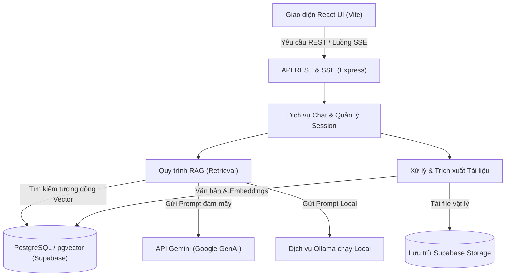
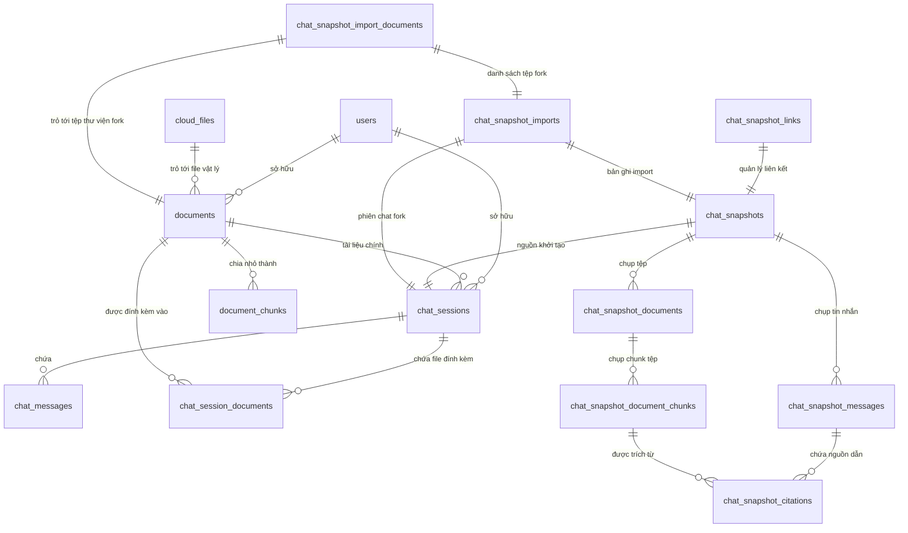
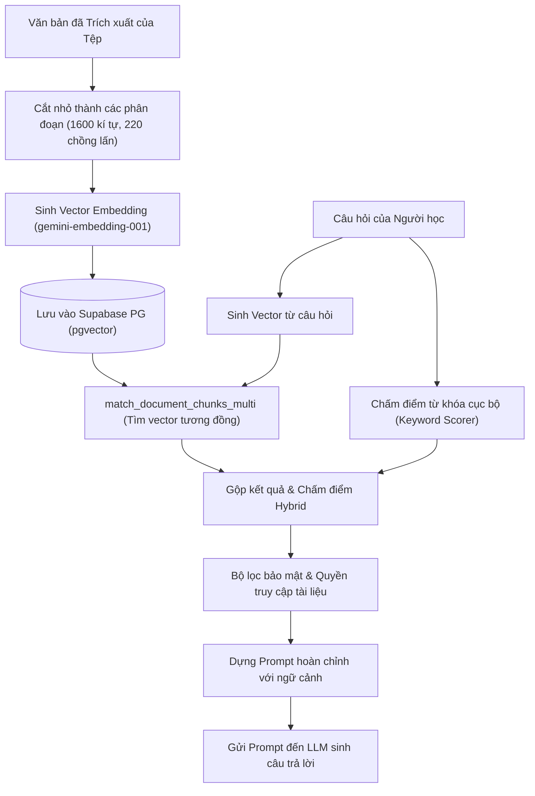
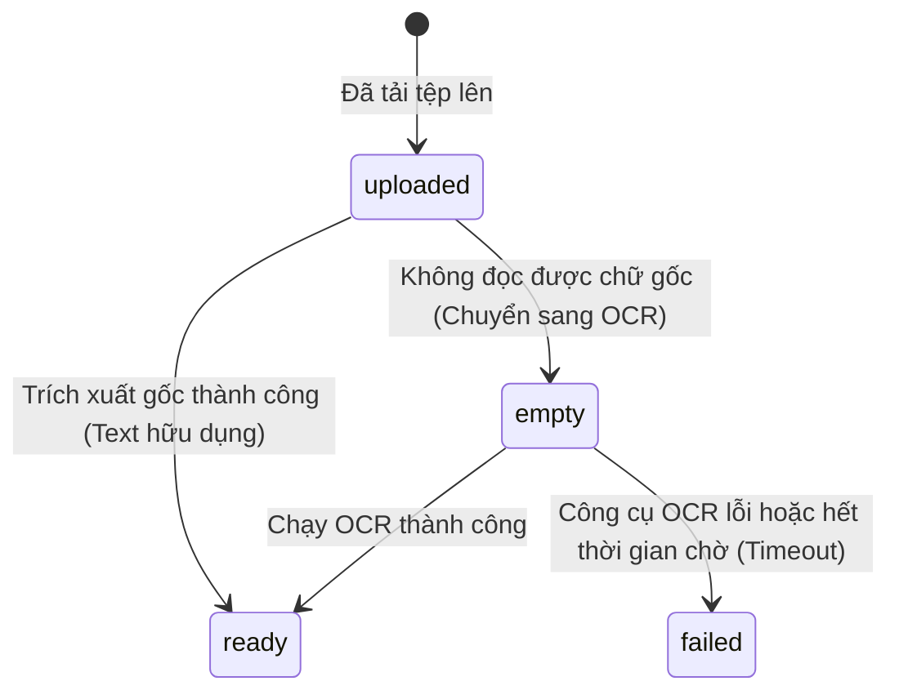
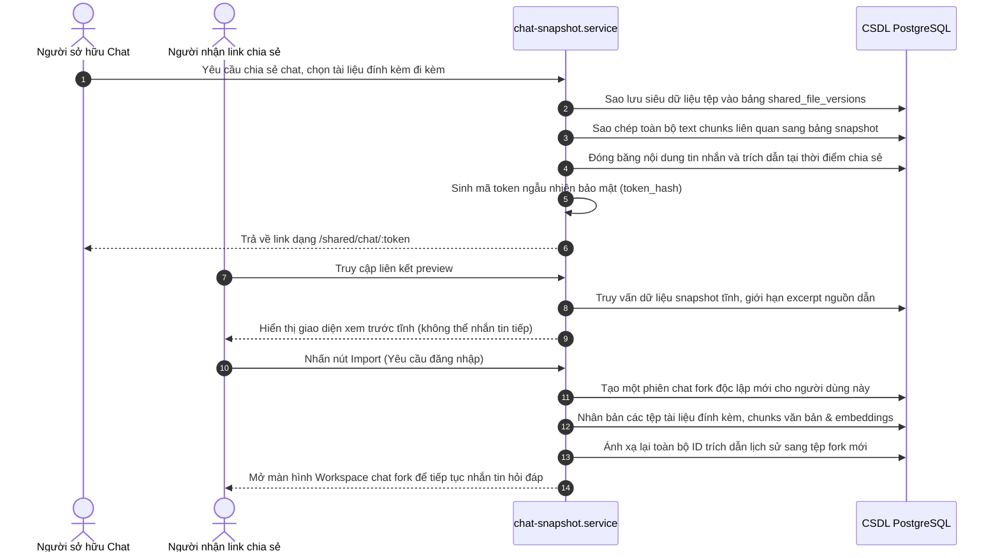
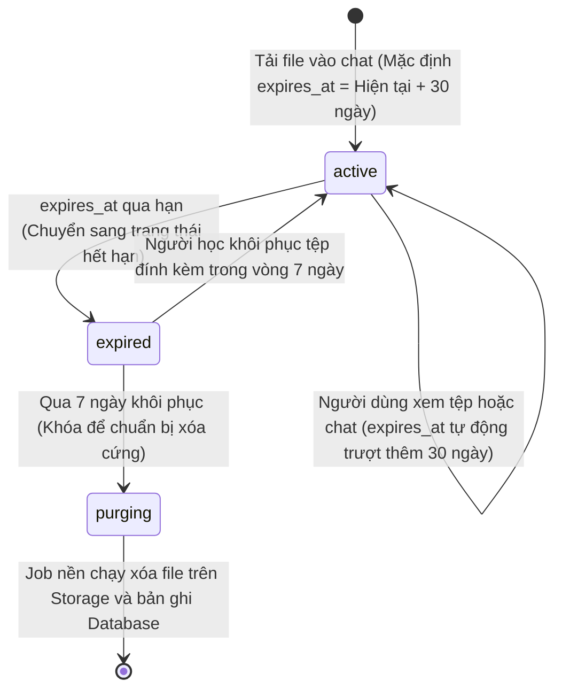

# AI Study Hub - Tài liệu Kiến trúc và Luồng Hoạt động Hệ thống Chatbot & AI

Tài liệu này đóng vai trò là tham chiếu kỹ thuật toàn diện cho chatbot và phân hệ AI (AI Subsystem) của dự án AI Study Hub. Tài liệu chi tiết hóa thiết kế tổng thể, mô hình dữ liệu, luồng nghiệp vụ, quy trình xử lý tài liệu và các cấu hình hệ thống dành cho lập trình viên, người vận hành, kiểm thử viên và quản trị hệ thống.

---

## Mục lục

1. [Tổng quan](#1-tổng-quan)
2. [Hạ tầng Công nghệ (Technology Stack)](#2-hạ-tầng-công-nghệ-technology-stack)
3. [Bản đồ Thư mục và Mã nguồn](#3-bản-đồ-thư-mục-và-mã-nguồn)
4. [Mô hình Miền Cốt lõi (Core Domain Model)](#4-mô-hình-miền-cốt-lõi-core-domain-model)
5. [Luồng Chat Tiêu chuẩn](#5-luồng-chat-tiêu-chuẩn)
6. [Vòng đời Session và Lịch sử Chat](#6-vòng-đời-session-và-lịch-sử-chat)
7. [Trò chuyện Đa tài liệu và File đính kèm](#7-trò-chuyện-đa-tài-liệu-và-file-đính-kèm)
8. [Quy trình Retrieval-Augmented Generation (RAG)](#8-quy-trình-retrieval-augmented-generation-rag)
9. [Xử lý và Trích xuất Văn bản Tài liệu](#9-xử-lý-và-trích-xuất-văn-bản-tài-liệu)
10. [Kiến trúc OCR](#10-kiến-trúc-ocr)
11. [Nhà cung cấp Dịch vụ AI (AI Providers)](#11-nhà-cung-cấp-dịch-vụ-ai-ai-providers)
12. [Xây dựng Prompt và Hành vi Phản hồi](#12-xây-dựng-prompt-và-hành-vi-phản-hồi)
13. [SSE Streaming (Truyền dữ liệu dạng Luồng)](#13-sse-streaming-truyền-dữ-liệu-dạng-luồng)
14. [Trích dẫn và Nguồn thông tin (Citations & Sources)](#14-trích-dẫn-và-nguồn-thông-tin-citations--sources)
15. [Snapshot Chia sẻ và Fork Chat Nhập về](#15-snapshot-chia-sẻ-và-fork-chat-nhập-về)
16. [Phân quyền và Bảo mật](#16-phân-quyền-và-bảo-mật)
17. [Vòng đời Tài liệu và Dọn dẹp Tự động](#17-vòng-đời-tài-liệu-và-dọn-dẹp-tự-động)
18. [Luồng Frontend và Bản đồ Giao diện](#18-luồng-frontend-và-bản-đồ-giao-diện)
19. [Danh sách API Hệ thống (API Reference)](#19-danh-sách-api-hệ-thống-api-reference)
20. [Biến Môi trường (Environment Variables)](#20-biến-môi-trường-environment-variables)
21. [Xử lý Lỗi và Hướng dẫn Khắc phục](#21-xử-lý-lỗi-và-hướng-dẫn-khắc-phục)
22. [Kiểm thử (Testing)](#22-kiểm-thử-testing)
23. [Tính năng Mở rộng và Kế hoạch Tương lai](#23-tính-năng-mở-rộng-và-kế-hoạch-tương-lai)
24. [Hướng dẫn Bảo trì dành cho Nhà phát triển](#24-hướng-dẫn-bảo-trì-dành-cho-nhà-phát-triển)

---

## 1. Tổng quan

AI Study Hub cung cấp một không gian học tập nâng cao nơi người dùng có thể trò chuyện trực tiếp với một hoặc nhiều tài liệu, thực hiện phân tích so sánh, trích xuất kiến thức và ghi chú trực tiếp lên tệp tài liệu.

### Các Tính năng Cốt lõi
* **Trò chuyện Đơn & Đa tài liệu**: Chat với một tài liệu chính (Primary Document) và tối đa 9 file đính kèm phụ (Attachments).
* **Tìm kiếm Lai (Hybrid RAG)**: Kết hợp tìm kiếm ngữ nghĩa theo vector (Vector Similarity) và chấm điểm tần suất từ khóa truyền thống (Keyword Search).
* **Xử lý Tài liệu Thông minh**: Trích xuất văn bản gốc trực tiếp, tự động chuyển hướng sang quét ảnh OCR (Tesseract) và cắt trang PDF (mutool) nếu tài liệu dạng bản quét (Scanned PDF).
* **Snapshot Không thể Thay đổi (Immutable Shared Snapshot)**: Đóng băng lịch sử chat tại thời điểm chia sẻ tạo liên kết xem trực quan công khai.
* **Nhập nhánh Chat (Idempotent Fork Import)**: Người dùng khác có thể sao chép snapshot công khai thành một session chat cá nhân để tiếp tục thảo luận.
* **Lưu vào Tài liệu của tôi**: Chuyển đổi tài liệu tạm thời trong phiên chat thành tài liệu cá nhân vĩnh viễn trong Thư viện.

### Sơ đồ Kiến trúc Phân hệ AI (AI Subsystem)



---

## 2. Hạ tầng Công nghệ (Technology Stack)

### Giao diện (Frontend)
* **Thư viện chính**: React 18.3 (biên dịch bằng Vite 5.4).
* **Giao diện & Style**: TailwindCSS v4.
* **Kết nối HTTP**: Axios cho các API REST thông thường; API Fetch gốc (Native Fetch) của trình duyệt để đọc và phân tách dữ liệu dạng luồng dữ liệu (SSE Stream).
* **Hiển thị PDF**: `react-pdf` (v10.4) kết hợp với `pdfjs-dist` (v5.4) để vẽ PDF lên thẻ Canvas.
* **OCR phía Client**: Tích hợp sẵn `tesseract.js` (v7.0) làm giải pháp dự phòng phía Client.

### Máy chủ (Backend)
* **Môi trường chạy**: Node.js v20.x, xây dựng trên Express.js.
* **Xử lý File tải lên**: `multer` cấu hình nhận tệp multipart/form-data.
* **Lập lịch Tác vụ**: `node-cron` chạy các job dọn dẹp và kiểm tra định kỳ định dạng Cron.
* **Bộ công cụ dòng lệnh (CLI Binaries)**:
  * **Tesseract CLI**: Chạy nhận diện ký tự trên ảnh hoặc trang PDF bản quét.
  * **MuPDF (mutool)**: Trích xuất ảnh raster phân giải cao (PNG) từ PDF để cấp cho OCR.
  * **pdftoppm / LibreOffice**: Các công cụ chuyển đổi tài liệu văn bản khác chạy ngầm.

### Dữ liệu & Hạ tầng
* **Cơ sở dữ liệu**: Supabase PostgreSQL kích hoạt extension `pgvector` xử lý vector embedding 768 chiều.
* **Lưu trữ Tệp**: Supabase Storage Buckets (lưu trữ tệp gốc tại bucket `documents`).
* **AI Gemini SDK**: `@google/genai` (v2.6) Node.js SDK chính thức.
* **Tích hợp Local LLM**: Kết nối trực tiếp đến cổng HTTP API của Ollama chạy local (mặc định cổng 11434).

---

## 3. Bản đồ Thư mục và Mã nguồn

Bảng dưới đây ánh xạ các thư mục và tệp mã nguồn quan trọng chịu trách nhiệm thực thi các chức năng Chatbot và AI:

| Tầng chức năng | Tệp nguồn | Lớp / Hàm quan trọng | Trách nhiệm chính |
| :--- | :--- | :--- | :--- |
| **Định tuyến (Routes)** | [ai.routes.js](file:///c:/QUOC%20DAT/STUDY/SWP/AI-Study-Hub/backend/src/routes/ai.routes.js) | Express Router | Đăng ký các API xử lý tài liệu, đặt câu hỏi và stream phản hồi SSE. |
| **Định tuyến (Routes)** | [chat.routes.js](file:///c:/QUOC%20DAT/STUDY/SWP/AI-Study-Hub/backend/src/routes/chat.routes.js) | Express Router | Đăng ký API quản lý session, file đính kèm chat, chia sẻ snapshot, import fork. |
| **Điều hướng (Controllers)** | [ai.controller.js](file:///c:/QUOC%20DAT/STUDY/SWP/AI-Study-Hub/backend/src/controllers/ai.controller.js) | `askSessionStream`, `processDocument` | Nhận tham số đầu vào, thiết lập Header cho SSE Stream và phản hồi lỗi công khai. |
| **Điều hướng (Controllers)** | [chat.controller.js](file:///c:/QUOC%20DAT/STUDY/SWP/AI-Study-Hub/backend/src/controllers/chat.controller.js) | `attachExistingDocument` | Phối hợp các thao tác liên kết tệp đính kèm và tải file trực tiếp trong chat. |
| **Điều hướng (Controllers)** | [chat-snapshot.controller.js](file:///c:/QUOC%20DAT/STUDY/SWP/AI-Study-Hub/backend/src/controllers/chat-snapshot.controller.js) | `createSnapshot`, `importSnapshot` | Điều hướng tạo snapshot và xử lý nghiệp vụ nhân bản chat fork. |
| **Nghiệp vụ (Services)** | [ai.service.js](file:///c:/QUOC%20DAT/STUDY/SWP/AI-Study-Hub/backend/src/services/ai.service.js) | `processDocument`, `prepareAsk` | Điều phối toàn bộ quá trình phân mảnh văn bản, sinh embedding và RAG đa tài liệu. |
| **Nghiệp vụ (Services)** | [ai-provider.service.js](file:///c:/QUOC%20DAT/STUDY/SWP/AI-Study-Hub/backend/src/services/ai-provider.service.js) | `generateAnswer`, `streamAnswer` | Dựng prompt hoàn chỉnh (System & User), gọi API của Gemini hoặc Ollama. |
| **Nghiệp vụ (Services)** | [ai-usage.service.js](file:///c:/QUOC%20DAT/STUDY/SWP/AI-Study-Hub/backend/src/services/ai-usage.service.js) | `assertQuota`, `getUsage` | Ràng buộc số yêu cầu, số token sử dụng mỗi phút/ngày đối với từng người dùng. |
| **Nghiệp vụ (Services)** | [chat-context.service.js](file:///c:/QUOC%20DAT/STUDY/SWP/AI-Study-Hub/backend/src/services/chat-context.service.js) | `analyzeRequest`, `mergeConstraints` | Phân tích lịch sử chat để xác định ý định so sánh, yêu cầu viết ngắn, hoặc đổi định dạng. |
| **Nghiệp vụ (Services)** | [rag.service.js](file:///c:/QUOC%20DAT/STUDY/SWP/AI-Study-Hub/backend/src/services/rag.service.js) | `splitTextIntoChunks`, `retrieveRelevantChunks` | Phân mảnh văn bản theo độ dài, chấm điểm tìm kiếm từ khóa cục bộ. |
| **Nghiệp vụ (Services)** | [rag-comparison.service.js](file:///c:/QUOC%20DAT/STUDY/SWP/AI-Study-Hub/backend/src/services/rag-comparison.service.js) | `retrieveComparisonEvidence` | Trích xuất các thực thể công nghệ và căn chỉnh các đoạn đối chiếu tương đương. |
| **Nghiệp vụ (Services)** | [chat-snapshot.service.js](file:///c:/QUOC%20DAT/STUDY/SWP/AI-Study-Hub/backend/src/services/chat-snapshot.service.js) | `createSnapshot`, `importSnapshot` | Tạo bản ghi đóng băng, ánh xạ liên kết vật lý thành phiên bản chia sẻ độc lập. |
| **Nghiệp vụ (Services)** | [session-attachment.service.js](file:///c:/QUOC%20DAT/STUDY/SWP/AI-Study-Hub/backend/src/services/session-attachment.service.js) | `uploadSessionDocument`, `saveToLibrary` | Quản lý vòng đời file tạm thời đính kèm trong chat và nâng cấp thành file cá nhân. |
| **Nghiệp vụ (Services)** | [session-document-lifecycle.service.js](file:///c:/QUOC%20DAT/STUDY/SWP/AI-Study-Hub/backend/src/services/session-document-lifecycle.service.js) | `runLifecycleCleanup` | Thực hiện quét dọn tự động các tệp hết hạn và thu hồi tài nguyên lưu trữ. |
| **Nghiệp vụ (Services)** | [ocr.service.js](file:///c:/QUOC%20DAT/STUDY/SWP/AI-Study-Hub/backend/src/services/ocr.service.js) | `extractPdfText`, `extractImageText` | Quản lý quy trình gọi dòng lệnh `mutool` trích xuất ảnh và gọi `tesseract` để OCR. |
| **Nghiệp vụ (Services)** | [document-text.service.js](file:///c:/QUOC%20DAT/STUDY/SWP/AI-Study-Hub/backend/src/services/document-text.service.js) | `extractTextFromBuffer` | Phân tích tính hữu dụng của văn bản trích xuất gốc; định tuyến sang fallback OCR PDF. |
| **Dữ liệu (Models)** | [chat.model.js](file:///c:/QUOC%20DAT/STUDY/SWP/AI-Study-Hub/backend/src/models/chat.model.js) | `addMessage`, `listSessionDocuments` | Ghi log tin nhắn, quản lý liên kết bảng `chat_session_documents`. |
| **Dữ liệu (Models)** | [document.model.js](file:///c:/QUOC%20DAT/STUDY/SWP/AI-Study-Hub/backend/src/models/document.model.js) | `create`, `restoreSessionDocument` | Cập nhật thông tin tài liệu, các thuộc tính vòng đời (lifecycle_status). |
| **Lập lịch (Jobs)** | [sessionDocumentCleanup.job.js](file:///c:/QUOC%20DAT/STUDY/SWP/AI-Study-Hub/backend/src/jobs/sessionDocumentCleanup.job.js) | `startSessionDocumentCleanupJob` | Đăng ký job cron chạy nền để kiểm tra thu hồi tệp đính kèm tạm thời. |

---

## 4. Mô hình Miền Cốt lõi (Core Domain Model)

Hệ thống phân biệt rõ ràng giữa các loại tài liệu và trạng thái tồn tại:
* **Tài liệu Thư viện (Library Document)**: Tài liệu lưu trữ vĩnh viễn thuộc sở hữu cá nhân hoặc được chia sẻ qua liên kết người dùng cụ thể.
* **Tài liệu Phiên chat (Session Document)**: Tài liệu tải trực tiếp vào chat, chỉ tồn tại phục vụ phiên chat hiện thời. Hết hạn sau 30 ngày và có thể khôi phục trong vòng 7 ngày trước khi bị xóa vĩnh viễn.
* **Snapshot đóng băng (Shared Snapshot)**: Bản ghi không thể chỉnh sửa, ghi lại toàn bộ hội thoại và văn bản các tài liệu liên quan tại thời điểm chia sẻ.
* **Fork nhập về (Imported Fork Session)**: Phiên chat độc lập do người dùng nhập về sở hữu, cho phép chat tiếp và sửa đổi mà không ảnh hưởng tới snapshot gốc.

### Sơ đồ Mối quan hệ Thực thể Database (ERD)



---

## 5. Luồng Chat Tiêu chuẩn

Khi người dùng gửi câu hỏi từ giao diện Chat của tài liệu, hệ thống xử lý qua luồng truyền tin (SSE Stream) sau:

```mermaid
sequenceDiagram
  autonumber
  actor User as Người dùng
  participant UI as Giao diện UI (WorkspacePage)
  participant API as API Express (ai.routes)
  participant Context as chat-context.service
  participant RAG as rag.service / embedding.service
  participant DB as CSDL PostgreSQL (pgvector)
  participant LLM as ai-provider.service (Gemini/Ollama)

  User->>UI: Nhập câu hỏi và nhấn gửi
  UI->>UI: Hiển thị ngay tin nhắn User (Optimistic UI)
  UI->>API: POST /api/ai/chat/sessions/:sessionId/ask/stream
  API->>API: Xác thực JWT người dùng (verifyToken)
  API->>Context: Phân tích intent, lịch sử chat & danh sách doc đính kèm
  Context-->>API: Trả về so sánh/hỏi đáp, giới hạn text & danh sách ID tài liệu
  API->>RAG: Tìm kiếm các đoạn tài liệu tương ứng (semantic vector + keywords)
  RAG->>DB: Gọi hàm match_document_chunks_multi(docIds, queryEmbedding)
  DB-->>RAG: Trả về các phân đoạn văn bản tương đồng (Cosine distance)
  RAG->>RAG: Gộp kết quả, chấm điểm Hybrid, lọc bảo mật chéo tài liệu
  API->>LLM: Gửi Prompt hoàn chỉnh tới LLM (streamAnswer)
  LLM->>API: Trả về từng token văn bản (chunk-by-chunk)
  API-->>UI: Bắn sự kiện EventSource SSE dạng 'token'
  UI->>UI: Cập nhật văn bản hiển thị lên bong bóng Chat
  LLM-->>API: Hoàn tất stream; trả về thống kê token sử dụng
  API->>DB: Ghi đè lưu tin nhắn user và assistant vào bảng chat_messages
  API->>DB: Cập nhật thời gian hoạt động cuối cùng của session (touchSession)
  API-->>UI: Bắn sự kiện EventSource SSE 'done' kèm đầy đủ metadata
  UI->>UI: Thay thế ID tạm thời bằng dữ liệu tin nhắn thật từ CSDL
```

### Định dạng Dữ liệu (Payload) Minh họa

#### Request gửi hỏi (dạng Stream)
```http
POST /api/ai/chat/sessions/45/ask/stream HTTP/1.1
Content-Type: application/json
Authorization: Bearer <jwt-token>

{
  "question": "So sánh yêu cầu cơ sở dữ liệu giữa 2 tài liệu SRS này?",
  "mode": "hybrid",
  "model": "gemini-2.5-flash"
}
```

#### Dữ liệu SSE Stream phản hồi từ Server
```text
event: status
data: {"message":"Searching relevant chunks..."}

event: token
data: {"text":"Đối "}

event: token
data: {"text":"với hệ thống "}

event: done
data: {"answer":"Đối với hệ thống...","sources":[{"documentId":10,"chunkIndex":3,"content":"Hệ thống A sử dụng MySQL..."}],"messages":{"user":{"id":150,"content":"..."},"assistant":{"id":151,"content":"..."}}}
```

---

## 6. Vòng đời Session và Lịch sử Chat

1. **Khởi tạo Session**: Tự động tạo khi người dùng click xem tài liệu lần đầu (`getOrCreateSession`) hoặc tạo thủ công ở menu bên (`createSession`). Mỗi session luôn liên kết cứng với một tệp chính `primary_document_id`.
2. **Đặt Tiêu đề**: Mặc định lấy tiêu đề tài liệu chính hoặc chuỗi "New chat". Người dùng có thể đổi tiêu đề qua `PATCH /api/chat/sessions/:sessionId`.
3. **Tải Lịch sử**: Hàm `GET /api/chat/sessions/:sessionId/messages` tải toàn bộ tin nhắn trước đó, sắp xếp theo thời gian tăng dần. Hệ thống chỉ lấy tối đa 8 tin nhắn gần nhất (`getRecentConversation`), giới hạn ký tự dưới 6.000 để tránh tràn ngữ cảnh của mô hình AI.
4. **Xóa Session**: Khi xóa session (`deleted_at = NOW()`), bản ghi bị ẩn khỏi danh sách. Tất cả các tài liệu đính kèm dạng tạm thời (`document_scope = 'session'`) trong session đó sẽ bị kích hoạt đếm ngược thời gian hết hạn để dọn dẹp vật lý.
5. **Xóa Tài liệu Chính**: Nếu tài liệu chính của thư viện bị xóa, toàn bộ session chat phụ thuộc vào nó cũng bị đánh dấu xóa mềm để đảm bảo tính toàn vẹn dữ liệu.

---

## 7. Trò chuyện Đa tài liệu và File đính kèm

* **Tách biệt Vai trò**: Hệ thống chia làm hai thực thể: **Tài liệu chính** (Primary Document) - đóng vai trò neo giữ session, và **Tài liệu đính kèm** (Attachments) - đóng vai trò bổ trợ nội dung.
* **Giới hạn số lượng**: Cho phép đính kèm tối đa **10 tài liệu hoạt động** (Active attachments) trong một phiên chat. Hệ thống sử dụng khóa advisory `pg_advisory_xact_lock(15401, session_id)` tại Database để serialize các thao tác ghi đồng thời từ phía Client.
* **Điều kiện sẵn sàng**: File đính kèm bắt buộc phải hoàn thành trích xuất văn bản và tạo embedding thành công trước khi tham gia vào quá trình trả lời câu hỏi.
* **Lọc bỏ tài liệu lỗi**: Quá trình RAG tự động bỏ qua các file đính kèm đã bị xóa mềm, hết hạn, đang trong trạng thái purging hoặc không thuộc quyền sở hữu của người dùng.
* **Xử lý Ý định So sánh**: Phân hệ `chat-context.service.js` nhận diện từ khóa so sánh, tự động trích xuất các ID tài liệu cần so sánh từ câu hỏi hoặc kế thừa từ ngữ cảnh của tin nhắn trước đó. Nó gom tài liệu và định cấu hình prompt so sánh nghiêm ngặt (chỉ liệt kê điểm khác biệt được hỗ trợ bởi chứng cứ thực tế, không bịa đặt điểm tương đồng).
* **Mã hóa Nguồn Trích dẫn**: Các nguồn dẫn hiển thị trên giao diện được ánh xạ động về ID tài liệu hiện tại trong không gian làm việc của người dùng để hiển thị đúng liên kết xem.

---

## 8. Quy trình Retrieval-Augmented Generation (RAG)

Quy trình RAG đảm bảo câu trả lời của AI luôn được neo dựa trên các phân đoạn kiến thức lấy từ tài liệu thực tế của người học.



### Công thức Chấm điểm Tìm kiếm Lai (Hybrid Score)

Sự kết hợp này giúp khắc phục điểm yếu của tìm kiếm vector (dễ bỏ qua các mã yêu cầu, thuật từ viết tắt) và tìm kiếm từ khóa (bỏ qua ngữ nghĩa đồng nghĩa):

```text
Điểm số = (0.7 * CosineSimilarity) + (0.3 * NormalizedKeywordScore)
```
* **Cosine Similarity**: Điểm tương đồng cosine giữa vector câu hỏi và vector phân đoạn văn bản.
* **Normalized Keyword Score**: Điểm số từ khóa của phân đoạn đó sau khi chia cho điểm số từ khóa lớn nhất tìm được trong lượt quét hiện tại.
* **Chế độ Document-only vs Hybrid**: Chế độ **Document-only** chỉ cho phép AI dùng thông tin trong tài liệu đính kèm (nếu không có thì trả lời không biết). Chế độ **Hybrid** cho phép AI bổ sung kiến thức phổ thông bên ngoài để giải thích rõ hơn cho người học.

---

## 9. Xử lý và Trích xuất Văn bản Tài liệu

Phân hệ xử lý văn bản đảm nhận việc xử lý thô tệp tải lên và chuyển đổi sang chuỗi text sạch trước khi chia nhỏ.

### Định dạng hỗ trợ và Phương pháp xử lý

* **Tệp PDF**: Đầu tiên sử dụng thư viện `pdf-parse` để đọc nhanh văn bản gốc. Nếu chuỗi text trả về có độ dài nhỏ hơn 50 ký tự hoặc chứa text giữ chỗ hệ thống (placeholder), tệp sẽ được chuyển sang quy trình OCR dự phòng.
* **PDF bản quét (OCR Fallback)**: Gọi công cụ `mutool` cắt tối đa 10 trang đầu thành ảnh PNG phân giải 200 DPI, sau đó gọi `tesseract` để nhận diện chữ trên từng ảnh.
* **Tệp Word (.docx)**: Sử dụng thư viện `mammoth` để đọc cấu trúc XML và trích xuất chuỗi text thô.
* **Tệp Ảnh (PNG, JPEG, TIFF, BMP)**: Giới hạn dung lượng dưới 15MB, đưa trực tiếp qua Tesseract CLI để OCR.

### Sơ đồ Trạng thái Trích xuất Tài liệu (Extraction Status)



---

## 10. Kiến trúc OCR

Hệ thống tích hợp công cụ nhận diện ký tự quang học (OCR) chạy cục bộ trên máy chủ thông qua dòng lệnh CLI để tối ưu bảo mật và không phát sinh chi phí API bên ngoài.

* **Công cụ Tích hợp**: Giao tiếp trực tiếp với file chạy `tesseract` và `mutool` cấu hình trong biến môi trường PATH.
* **Cắt Trang PDF**: Dùng lệnh `mutool draw -o page-%03d.png -r 200 input.pdf 1-10` để kết xuất các trang thành ảnh nén.
* **Hàng đợi Giới hạn Concurrency**: Chức năng OCR được đưa vào hàng đợi xử lý tuần tự (`DEFAULT_MAX_CONCURRENT_JOBS = 1`) để tránh tình trạng CPU quá tải khi nhiều người dùng cùng chạy OCR tệp lớn.
* **Dọn dẹp Thư mục Tạm**: Tất cả các tệp ảnh cắt ra trong quá trình chạy được lưu tại thư mục tạm của hệ điều hành (`os.tmpdir()`) và bị xóa vĩnh viễn (force delete) ngay khi kết thúc xử lý hoặc khi gặp lỗi đột ngột.
* **Cách tính Confidence**: Phân tích tệp TSV từ Tesseract trả về, loại bỏ từ rác và tính trung bình cộng độ tin cậy của các từ đọc được:
  ```text
  Độ tin cậy = Tổng điểm tin cậy các từ / Số lượng từ nhận diện
  ```

---

## 11. Nhà cung cấp Dịch vụ AI (AI Providers)

Hệ thống cho phép cấu hình linh hoạt giữa dịch vụ đám mây mạnh mẽ và mô hình cục bộ bảo mật miễn phí.

### Bảng So sánh Nhà cung cấp AI

| Đặc tính kỹ thuật | Đám mây Gemini API | Chạy Local Ollama (Qwen) |
| :--- | :--- | :--- |
| **Mô hình cho phép** | `gemini-2.5-flash`, `gemini-2.5-flash-lite`, `gemini-3.1-flash-lite`, `gemini-3-flash`, `gemini-3.5-flash` | `qwen2.5:3b` |
| **Thư viện kết nối** | SDK chính thức `@google/genai` | Gọi trực tiếp cổng REST API HTTP của Ollama |
| **Hành vi Stream** | Dùng cơ chế Stream API gốc của Google | Đọc Buffer và giải mã JSON stream từng dòng |
| **Yêu cầu cài đặt** | Cần Internet và cấu hình khóa `GEMINI_API_KEY` | Cần cài đặt Ollama ngầm trên máy chủ |
| **Giới hạn lượt gọi** | Bị kiểm soát bởi hệ thống Quota của Gemini | Hoàn toàn không giới hạn |

### Cơ chế Chuyển đổi Mô hình (Model Switching)

1. **Bộ chọn trên UI**: Người học thay đổi mô hình ngay tại chân khung chat. Lựa chọn này được lưu vào trạng thái phiên làm việc cá nhân.
2. **Backend xác thực**: Mỗi request gửi lên, server kiểm tra model đó có nằm trong allowlist cấu hình tại `.env` hay không.
3. **Kiểm tra Quota**: Đối với Gemini, server kiểm tra số lượng câu hỏi đã gửi trong ngày của User đó qua bảng `ai_usage_logs`. Nếu chạm trần giới hạn quota, server sẽ từ chối hoặc hướng dẫn người dùng chuyển sang mô hình Local Qwen.

---

## 12. Prompt Construction và Response Behavior

Prompt gửi đến AI được lắp ghép động từ lịch sử chat, các đoạn tài liệu tìm được và các chỉ dẫn định dạng chặt chẽ.

### Quy tắc lắp ghép Prompt

* **System Prompt (Chỉ dẫn hệ thống)**: Định rõ vai trò của AI là Trợ lý học tập của AI Study Hub. Thiết lập chỉ dẫn ngôn ngữ và cách ứng xử tương ứng với chế độ câu hỏi (Hybrid hay Document-only).
* **Ngữ cảnh Tài liệu**: Liệt kê các đoạn trích tìm được dưới dạng chuẩn hóa:
  `[Source {Số thứ tự} | Document: {Tên tài liệu} | chunk {Số phân đoạn} | Page {Trang}]`
* **Ràng buộc Định dạng**: Nếu người dùng hỏi các câu có từ khóa dạng bảng biểu, gạch đầu dòng, hoặc viết một đoạn văn ngắn gọn, Prompt builder sẽ tự động thêm chỉ dẫn định dạng tương thích tương ứng vào cuối System Prompt.
* **Xử lý Đa Ngôn ngữ**: Ưu tiên trả lời bằng ngôn ngữ mà câu hỏi hiện tại đang sử dụng. Nếu câu hỏi không rõ ràng hoặc pha trộn ngôn ngữ, trợ lý sẽ phản hồi bằng tiếng Việt.
* **Chống Ảo tưởng (Hallucination)**: System prompt ra lệnh cấm AI tự ý bịa ra các số nguồn trích dẫn dạng `[Source X]` hoặc gộp tài liệu này vào nguồn của tài liệu kia. Mọi nguồn dẫn phải khớp chính xác với ngữ cảnh cung cấp.

---

## 13. SSE Streaming (Truyền dữ liệu dạng Luồng)

Việc truyền câu trả lời từng từ một sử dụng cơ chế Server-Sent Events (SSE) giúp người dùng không phải chờ đợi lâu khi AI sinh văn bản dài.

### Các loại Sự kiện trong luồng SSE

| Tên sự kiện (Event) | Ý nghĩa hiển thị | Cấu trúc dữ liệu mẫu |
| :--- | :--- | :--- |
| **`status`** | Cập nhật tiến độ xử lý ngầm (đang tìm kiếm, đang sinh embedding...). | `{"message": "Searching relevant chunks..."}` |
| **`token`** | Trả về một hoặc vài từ tiếp theo của câu trả lời AI. | `{"text": "hệ thống "}` |
| **`done`** | Báo hiệu luồng stream kết thúc thành công, gửi kèm thông tin hoàn chỉnh. | `{"answer": "...", "sources": [...], "messages": {...}}` |
| **`error`** | Gửi thông báo lỗi trực tiếp để UI hiển thị dạng Toast thông báo. | `{"error": "AI service is temporarily unavailable."}` |

> [!NOTE]
> **Lưu ý triển khai proxy**: Nếu ứng dụng chạy sau các máy chủ proxy như Nginx hoặc Cloudflare, cần cấu hình tắt bộ đệm dữ liệu (`proxy_buffering off` hoặc `X-Accel-Buffering: no`) để tránh việc proxy giữ lại dữ liệu và xả ra cùng lúc làm mất hiệu ứng stream từng từ.

---

## 14. Trích dẫn và Nguồn thông tin (Citations & Sources)

Hệ thống tự động liên kết câu trả lời của AI với vị trí thực tế trong file tài liệu gốc.

* **Kiểm tra tính hợp lệ**: Hàm `buildValidatedEvidence` đối chiếu chéo các phân đoạn tài liệu tìm được bằng vector với danh sách tài liệu được phép đọc trong session hiện tại để loại bỏ các phân đoạn lạc hoặc không hợp lệ.
* **Giới hạn hiển thị Snapshot công khai**: Khi người dùng chưa đăng nhập xem snapshot chia sẻ công khai, hệ thống sẽ ẩn bớt các đoạn trích dẫn dài, chỉ hiển thị tóm tắt ngắn dưới 400 ký tự (`PUBLIC_CITATION_EXCERPT_LIMIT = 400`) để bảo vệ bản quyền tài liệu gốc.
* **Ánh xạ lại nguồn**: Khi một phiên chat được import thành một fork mới, toàn bộ nguồn trích dẫn của các câu hỏi cũ trong lịch sử sẽ được tính toán ánh xạ lại sang ID tài liệu mới tương ứng trong không gian làm việc của người dùng mới.

---

## 15. Snapshot Chia sẻ và Fork Chat Nhập về

Tính năng snapshot cho phép người học lưu giữ và chia sẻ cuộc hội thoại một cách an toàn và tĩnh.



### Nghiệp vụ "Lưu vào Tài liệu của tôi" (Save to Library)

Khi người dùng lưu tài liệu từ một chat snapshot được chia sẻ vào thư viện tài liệu cá nhân:
1. **Tiết kiệm Dung lượng**: Hệ thống kiểm tra trùng lặp thông qua mã hash nội dung tệp gốc. Nếu tệp vật lý đã tồn tại trên Supabase Storage, tài liệu mới sẽ tái sử dụng lại `file_id` và đường dẫn lưu trữ cũ mà không cần upload lại file mới.
2. **Tái sử dụng Chunks và Embeddings**: Sao chép trực tiếp các phân đoạn văn bản và vector embedding đã tính toán trước đó từ bảng snapshot sang bảng dữ liệu chính, loại bỏ hoàn toàn chi phí chạy OCR và chi phí gọi API tạo vector embedding của Google Gemini.
3. **Thăng cấp Tài liệu**: Nếu tệp được lưu là tài liệu chính của session fork hiện tại, hệ thống sẽ thực hiện tráo đổi liên kết: gỡ bỏ tài liệu đính kèm tạm thời ra khỏi session, liên kết tài liệu thư viện mới tạo thành `primary_document_id` của session, giúp người dùng tiếp tục chat bình thường mà không bị ảnh hưởng bởi thời hạn hết hạn 30 ngày.

---

## 16. Phân quyền và Bảo mật

Hệ thống thiết lập các quy tắc phân quyền chặt chẽ tại tầng mã nguồn backend và tầng RLS (Row Level Security) của PostgreSQL:

* **Sở hữu phiên chat**: Một session chat chỉ có thể được đọc và chỉnh sửa bởi chính người tạo ra nó (`user_id = auth.uid()`). Việc truy cập session của người khác sẽ nhận về lỗi `404 Chat session not found`.
* **Sở hữu tài liệu**: Quyền đọc và chỉnh sửa tài liệu thư viện yêu cầu người dùng là chủ sở hữu hoặc nằm trong danh sách được chia sẻ của bảng `doc_shares`.
* **Bypass phân quyền RAG đa tài liệu**: Khi người dùng nhập (import) một snapshot chat, họ được cấp quyền truy vấn vector trên các tệp đính kèm đi kèm phiên chat đó thông qua mối quan hệ trong bảng `chat_session_documents`. Cơ chế này cho phép người dùng hỏi đáp RAG trên tài liệu được chia sẻ mà không cần cấp quyền xem hoặc tải file đó một cách tùy tiện trong thư viện chung.
* **Bảo vệ đường dẫn tải tệp**: Các liên kết tải tệp vật lý trực tiếp đều sử dụng mã chữ ký có thời hạn ngắn (Signed URL) sinh ra từ Supabase Storage Client. Người dùng không thể đoán hoặc dùng URL trực tiếp để tải file của người khác.

---

## 17. Vòng đời Tài liệu và Dọn dẹp Tự động

Tất cả các tài liệu tải lên dạng tạm thời (Session Documents) đều có vòng đời giới hạn để tối ưu không gian lưu trữ của hệ thống.



### Các tác vụ dọn dẹp chạy nền (Background Jobs)

* **Dọn dẹp Vòng đời Tài liệu tạm**: Lập lịch chạy mỗi giờ một lần (`sessionDocumentCleanup.job.js` dựa trên Cron `SESSION_LIFECYCLE_CRON`). Job này gọi hàm RPC `expire_due_session_documents` để chuyển các tài liệu quá hạn sang trạng thái `expired`, và gọi `claim_session_documents_for_purge` khóa các tài liệu đã hết hạn 7 ngày để thực hiện xóa cứng tệp vật lý trên Supabase Storage.
* **Dọn dẹp Thùng rác (Trash Cleanup)**: Lập lịch chạy lúc 02:00 sáng hàng ngày (`0 2 * * *` cấu hình tại `trashCleanup.job.js`). Job này tự động quét và xóa cứng hoàn toàn mọi tài liệu trong thư viện đã nằm trong thùng rác (xóa mềm `deleted_at`) vượt quá 30 ngày.

---

## 18. Luồng Frontend và Bản đồ Giao diện

Bảng dưới đây mô tả cách các hành động của người dùng trên giao diện React tương tác với các API của Backend:

| Hành động của người dùng | Component giao diện | API Backend gọi | Kết quả xử lý |
| :--- | :--- | :--- | :--- |
| **Mở xem tài liệu** | `DocumentSidebar` | `GET /api/chat/session/:docId` | Mở session cũ hoặc tạo session mới, tải lịch sử chat. |
| **Đổi chế độ RAG** | `AIChatPanel` | Không gọi API (Lưu State Client) | Thay đổi tham số `mode` gửi lên khi đặt câu hỏi. |
| **Đổi mô hình AI** | `ModelMenu` | Không gọi API (Lưu State Client) | Thay đổi tham số `model` gửi lên khi đặt câu hỏi. |
| **Gửi câu hỏi** | `CompactInput` | `POST /api/ai/chat/sessions/:id/ask/stream` | Thiết lập cổng đọc luồng SSE, vẽ chữ chạy trên giao diện. |
| **Đính kèm tài liệu** | `ChatAttachmentBar` | `POST /api/chat/sessions/:id/documents` | Tạo liên kết tệp đính kèm mới vào session chat. |
| **Tải tệp đính kèm** | `ChatAttachmentBar` | `POST /api/chat/sessions/:id/documents/upload` | Tải tệp tạm lên Storage, chạy trích xuất và đính kèm vào session. |
| **Gỡ tệp đính kèm** | `ChatAttachmentBar` | `DELETE /api/chat/sessions/:id/documents/:docId` | Đánh dấu `removed_at` ẩn tệp khỏi danh sách hoạt động. |
| **Lưu tệp đính kèm** | `ChatAttachmentBar` | `POST /api/chat/sessions/:id/documents/:docId/save-to-library` | Gọi RPC nâng cấp tài liệu tạm thành tài liệu thư viện. |
| **Chia sẻ liên kết** | `ChatShareModal` | `POST /api/chat/sessions/:id/snapshots` | Đóng băng lịch sử chat, sinh link chia sẻ tĩnh. |

---

## 19. Danh sách API Hệ thống (API Reference)

### Nhóm API Quản lý Session Chat

* **`GET /api/chat/sessions`**
  * **Xác thực**: Bearer JWT
  * **Mô tả**: Liệt kê các phiên chat hoạt động của người dùng. Có thể lọc theo tệp gốc `?documentId=12`.
  * **Phản hồi**: `[{"id": 1, "title": "...", "primary_document_id": 12}]`

* **`POST /api/chat/sessions`**
  * **Xác thực**: Bearer JWT
  * **Mô tả**: Khởi tạo một phiên chat mới độc lập.
  * **Yêu cầu (Body)**: `{"title": "Phiên phân tích mới", "documentId": 12}`
  * **Phản hồi**: `{"id": 2, "title": "Phiên phân tích mới"}`

* **`GET /api/chat/session/:docId`**
  * **Xác thực**: Bearer JWT
  * **Mô tả**: Lấy phiên chat gần nhất của tài liệu hoặc tự động tạo mới nếu chưa có.
  * **Phản hồi**: `{"session": {"id": 1}, "messages": [], "documents": []}`

### Nhóm API Tệp Đính kèm trong Chat

* **`POST /api/chat/sessions/:sessionId/documents`**
  * **Xác thực**: Bearer JWT
  * **Mô tả**: Liên kết một tài liệu đã có trong thư viện vào phiên chat hiện tại.
  * **Yêu cầu (Body)**: `{"documentId": 15}`
  * **Phản hồi**: Trả về cấu trúc session đã cập nhật danh sách đính kèm.

* **`POST /api/chat/sessions/:sessionId/documents/upload`**
  * **Xác thực**: Bearer JWT
  * **Mô tả**: Tải trực tiếp một tài liệu mới dạng tạm thời và đính kèm vào session chat.
  * **Yêu cầu (Body)**: Gửi file dạng `multipart/form-data` với key là `file`.
  * **Phản hồi**: Trả về thông tin tệp vừa tạo và cấu trúc session mới.

* **`DELETE /api/chat/sessions/:sessionId/documents/:documentId`**
  * **Xác thực**: Bearer JWT
  * **Mô tả**: Xóa mềm tệp đính kèm khỏi phiên chat (chuyển sang trạng thái recoverable).
  * **Phản hồi**: Danh sách tệp đính kèm mới sau khi gỡ.

### Nhóm API Đặt câu hỏi và Stream AI

* **`POST /api/ai/chat/sessions/:sessionId/ask/stream`**
  * **Xác thực**: Bearer JWT
  * **Mô tả**: Gửi câu hỏi và nhận về luồng dữ liệu stream câu trả lời từ AI.
  * **Yêu cầu (Body)**: `{"question": "Tóm tắt chương 1", "mode": "hybrid", "model": "gemini-2.5-flash"}`
  * **Phản hồi**: Định dạng luồng văn bản `text/event-stream`.

### Nhóm API Snapshot và Chia sẻ

* **`POST /api/chat/sessions/:sessionId/snapshots`**
  * **Xác thực**: Bearer JWT
  * **Mô tả**: Đóng băng chat và tạo liên kết chia sẻ công khai.
  * **Yêu cầu (Body)**: `{"includedDocumentIds": [12, 13], "acknowledgedExcludedCitationDocumentIds": []}`
  * **Phản hồi**: `{"snapshotId": "...", "token": "...", "expiresAt": "..."}`

* **`GET /api/public/chat-snapshots/:token`**
  * **Xác thực**: Không yêu cầu (Public)
  * **Mô tả**: Xem thông tin preview của snapshot chia sẻ tĩnh (siêu dữ liệu và lịch sử hội thoại).
  * **Phản hồi**: `{"snapshot": {...}, "documents": [...], "messages": [...]}`

* **`POST /api/chat/shared-snapshots/:token/import`**
  * **Xác thực**: Bearer JWT
  * **Mô tả**: Nhập snapshot công khai thành một phiên chat fork cá nhân để tiếp tục đặt câu hỏi hỏi đáp.
  * **Phản hồi**: Chi tiết phiên chat mới được tạo ra cùng lịch sử tin nhắn sao chép.

---

## 20. Biến Môi trường (Environment Variables)

### Biến cấu hình Phân hệ AI & Providers

| Tên biến môi trường | Yêu cầu | Giá trị mặc định | Giải thích mục đích |
| :--- | :---: | :---: | :--- |
| **`GEMINI_API_KEY`** | Có (đối với Gemini) | Không có | Khóa API bí mật kết nối tới dịch vụ AI Gemini của Google. |
| **`AI_PROVIDER`** | Không | `gemini` | Chọn nhà cung cấp AI mặc định (`gemini` hoặc `ollama`). |
| **`GEMINI_MODEL`** | Không | `gemini-2.5-flash`| Tên mô hình Gemini mặc định được sử dụng. |
| **`GEMINI_ALLOWED_MODELS`**| Không | `gemini-2.5-flash,...` | Danh sách mô hình Gemini được phép chọn trên giao diện. |
| **`OLLAMA_BASE_URL`** | Không | `http://localhost:11434`| Đường dẫn kết nối tới cổng dịch vụ Ollama chạy local. |
| **`OLLAMA_MODEL`** | Không | `qwen2.5:3b` | Tên mô hình chạy local mặc định cần kéo về. |

### Biến cấu hình Vector Embedding

| Tên biến môi trường | Yêu cầu | Giá trị mặc định | Giải thích mục đích |
| :--- | :---: | :---: | :--- |
| **`EMBEDDING_PROVIDER`** | Không | `gemini` | Đơn vị tạo vector embedding ngữ nghĩa cho tài liệu. |
| **`EMBEDDING_MODEL`** | Không | `gemini-embedding-001`| Mô hình tạo vector embedding ngữ nghĩa. |
| **`EMBEDDING_DIMENSIONS`** | Không | `768` | Độ dài số chiều của vector đầu ra (768 chiều cho Gemini). |
| **`EMBEDDING_BATCH_SIZE`** | Không | `8` | Số lượng phân đoạn tài liệu gửi đi mã hóa trong một lượt API. |

### Biến cấu hình OCR & Trích xuất File

| Tên biến môi trường | Yêu cầu | Giá trị mặc định | Giải thích mục đích |
| :--- | :---: | :---: | :--- |
| **`TESSERACT_PATH`** | Không | `tesseract` | Đường dẫn tuyệt đối đến tệp chạy của phần mềm Tesseract CLI. |
| **`MUTOOL_PATH`** | No | `mutool` | Đường dẫn tuyệt đối đến tệp chạy của phần mềm MuPDF/mutool. |
| **`OCR_ENABLED`** | Không | `true` | Cờ bật/tắt toàn bộ tính năng OCR dự phòng bản quét. |
| **`OCR_LANG`** | Không | `eng+vie` | Ngôn ngữ huấn luyện nạp vào Tesseract (Tiếng Anh + Tiếng Việt). |
| **`OCR_MAX_PDF_PAGES`** | Không | `10` | Số trang PDF tối đa được quét ảnh OCR để tránh nghẽn server. |
| **`OCR_MAX_IMAGE_BYTES`** | Không | `15728640` | Kích thước ảnh tối đa cho phép đẩy vào OCR (15MB). |

---

## 21. Xử lý Lỗi và Hướng dẫn Khắc phục

| Triệu chứng lỗi | Nguyên nhân khả dĩ | Nơi cần kiểm tra | Phương án khắc phục |
| :--- | :--- | :--- | :--- |
| **`No readable document chunks`**| Tài liệu dạng ảnh quét hoàn toàn không có text thô, hoặc dịch vụ OCR đang bị tắt. | `document-text.service.js` | Đảm bảo máy chủ cài đặt `mutool` và `tesseract`, cấu hình đúng PATH và đặt `OCR_ENABLED=true`. |
| **`A chat session can contain at most 10 active attachments`** | Phiên chat hiện tại đã chạm mốc giới hạn tối đa 10 tài liệu đính kèm. | `session-attachment.service.js` | Người dùng cần nhấn gỡ bỏ bớt tài liệu đính kèm không dùng đến trước khi thêm tài liệu mới. |
| **`Ollama is not running`** | Máy chủ hoặc Docker không thể kết nối đến cổng API của Ollama. | `ollama.service.js` | Kiểm tra dịch vụ Ollama chạy nền đã khởi chạy chưa (`ollama run qwen2.5:3b`) và kiểm tra địa chỉ mạng. |
| **`CITED_ATTACHMENTS_EXCLUDED`**| Người dùng tạo snapshot chia sẻ nhưng bỏ chọn các tệp chứa chứng cứ nguồn dẫn cũ. | `chat-snapshot.service.js` | Yêu cầu người dùng tích chọn đầy đủ các tài liệu đã được dẫn nguồn trong hội thoại hoặc nhấn tích xác nhận bỏ qua. |
| **`SHARE_UNAVAILABLE`** | Liên kết chia sẻ snapshot đã bị người sở hữu khóa, thu hồi quyền truy cập hoặc hết hạn 30 ngày. | `chat-snapshot.service.js` | Liên hệ người sở hữu tạo lại liên kết chia sẻ mới. Dữ liệu chat gốc của họ vẫn được giữ nguyên. |
| **`Storage limit exceeded`** | Người dùng tải tệp vượt quá dung lượng bộ nhớ được cấp (mặc định 500MB). | `account.service.js` | Thực hiện xóa bớt tài liệu không còn sử dụng trong thư viện và dọn dẹp thùng rác để giải phóng dung lượng. |

---

## 22. Kiểm thử (Testing)

### Danh sách các Suite Kiểm thử Tự động

* **[chat-snapshot-sharing.test.js](file:///c:/QUOC%20DAT/STUDY/SWP/AI-Study-Hub/backend/test/chat-snapshot-sharing.test.js)**
  * **Mục tiêu**: Kiểm thử luồng tạo snapshot chia sẻ, chặn xem tệp trái phép và import fork.
  * **Assert quan trọng**: Đảm bảo các trích dẫn được ánh xạ lại chính xác khi import, và liên kết restricted từ chối hiển thị.
* **[chat-comparison.test.js](file:///c:/QUOC%20DAT/STUDY/SWP/AI-Study-Hub/backend/test/chat-comparison.test.js)**
  * **Mục tiêu**: Kiểm thử cơ chế phân tích ngữ cảnh so sánh tài liệu.
  * **Assert quan trọng**: Đảm bảo AI tập trung so sánh các ý có chứng cứ tương đồng, bỏ qua SQL Injection trong Prompt.
* **[ai-session-shared-access.test.js](file:///c:/QUOC%20DAT/STUDY/SWP/AI-Study-Hub/backend/test/ai-session-shared-access.test.js)**
  * **Mục tiêu**: Kiểm thử bảo mật chéo tài liệu trong phiên chat đa tài liệu.
  * **Assert quan trọng**: Xác nhận người dùng chỉ được hỏi đáp RAG trên tài liệu đã đính kèm phiên chat của họ, cấm truy vấn chéo.
* **[session-document-lifecycle.test.js](file:///c:/QUOC%20DAT/STUDY/SWP/AI-Study-Hub/backend/test/session-document-lifecycle.test.js)**
  * **Mục tiêu**: Kiểm thử các hàm SQL dọn dẹp vòng đời tệp nền.
  * **Assert quan trọng**: Đảm bảo các tiến trình chạy dọn dẹp đồng thời không xảy ra hiện tượng chết khóa (deadlock).

### Checklist Xác minh Thủ công (E2E)

1. **Quét tệp ảnh OCR**: Tải lên một tệp ảnh chứa chữ, kiểm tra xem hệ thống có tự chuyển sang trạng thái `indexed` và chat được bình thường không.
2. **Kiểm tra Kịch trần Đính kèm**: Mở một chat, đính kèm liên tiếp các tài liệu trong thư viện cho đến khi quá 10 tệp để kiểm tra xem có chặn và báo lỗi đẹp mắt không.
3. **Luồng Hỏi đáp Stream**: Gửi một câu hỏi dài, quan sát chữ chạy ra mượt mà và các nguồn dẫn (Sources) hiển thị đúng số trang/số phân đoạn.
4. **Đối chiếu So sánh**: Tải lên hai tệp SRS khác nhau, hỏi "So sánh sự khác nhau về cơ sở dữ liệu" để xem AI có trích xuất bảng so sánh chuẩn xác không.
5. **Chia sẻ và Nhập về**: Tạo liên kết chia sẻ chat, copy link mở tab ẩn danh xem trước, đăng nhập tài khoản khác nhấn Import và tiếp tục chat trên nhánh mới.
6. **Lưu tệp Snapshot**: Tại nhánh chat mới nhập về, nhấn "Lưu vào Tài liệu của tôi" và kiểm tra tệp đó có chuyển thành tệp thư viện cá nhân vĩnh viễn không.

---

## 23. Tính năng Mở rộng và Kế hoạch Tương lai

* **Trợ lý học tập thông minh (Planned)**: Kết nối với notebook để tự động gợi ý các câu hỏi ôn tập dựa trên các vùng kiến thức người dùng bôi đen highlighter.
* **Tự động sinh Slide tóm tắt (Planned)**: Xuất dàn ý tóm tắt của tài liệu sang tệp định dạng trình chiếu PowerPoint (.pptx).
* **Nhập ghi chú nhanh (Planned)**: Cho phép dán văn bản tự do trực tiếp vào khung chat dưới dạng một tệp tạm thời không cần upload file vật lý.
* **Hạ tầng Reranking (Planned)**: Tích hợp thêm tầng Reranker (như Cohere Rerank) sau khi lấy dữ liệu thô bằng Vector để tăng độ chính xác của ngữ cảnh RAG.

---

## 24. Hướng dẫn Bảo trì dành cho Nhà phát triển

> [!CAUTION]
> **Các Quy tắc Bất biến Nghiêm ngặt**:
> 1. **Tuyệt đối không hạ cấp phân quyền**: Không được tắt bỏ các kiểm tra quyền sở hữu tệp đính kèm trong `chat.controller.js`.
> 2. **Snapshot là Đóng băng**: Cấm viết bất kỳ API nào cho phép sửa đổi dữ liệu hoặc tin nhắn bên trong snapshot đã tạo.
> 3. **Tránh xử lý tệp trùng lặp**: Luôn kiểm tra trùng hash nội dung tệp trước khi lưu tệp vật lý mới để tái sử dụng tối đa tài nguyên có sẵn.
> 4. **Đồng bộ cơ chế phản hồi**: Khi thay đổi Prompt của AI, hãy đảm bảo cả API Stream (SSE) và API non-stream thông thường đều dùng chung cấu trúc Prompt.

### Thay đổi Prompt mặc định
Mọi thay đổi liên quan đến cấu trúc câu lệnh mặc định gửi tới AI đều phải thực hiện tại hàm `buildRagPrompts` thuộc tệp [ai-provider.service.js](file:///c:/QUOC%20DAT/STUDY/SWP/AI-Study-Hub/backend/src/services/ai-provider.service.js). Tránh việc hardcode prompt trực tiếp tại các controller hoặc model riêng lẻ.

### Cấu hình thuật toán Tìm kiếm RAG
Nếu cần căn chỉnh độ ưu tiên giữa tìm kiếm ngữ nghĩa Vector và tìm kiếm từ khóa, hãy điều chỉnh các trọng số `VECTOR_SCORE_WEIGHT` và `KEYWORD_SCORE_WEIGHT` tại tệp [ai.service.js](file:///c:/QUOC%20DAT/STUDY/SWP/AI-Study-Hub/backend/src/services/ai.service.js). Hãy đồng bộ các sửa đổi này với cách tính khoảng cách trong hàm SQL `match_document_chunks_multi` tại cơ sở dữ liệu.
