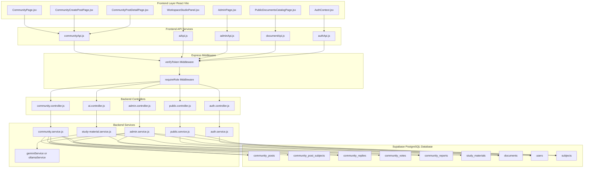
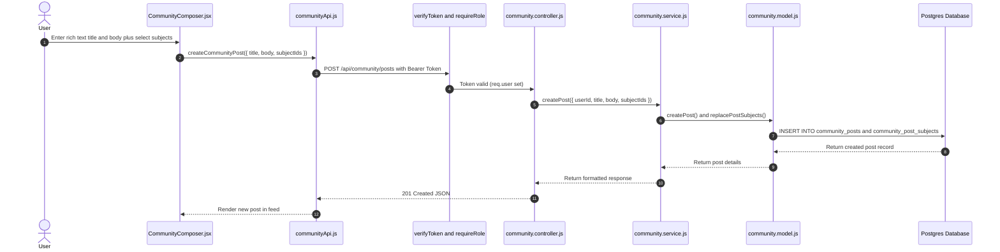
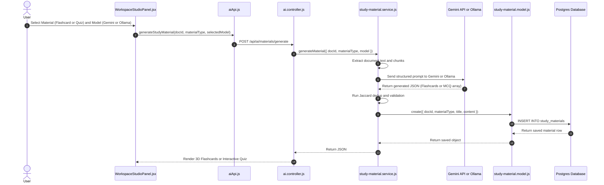
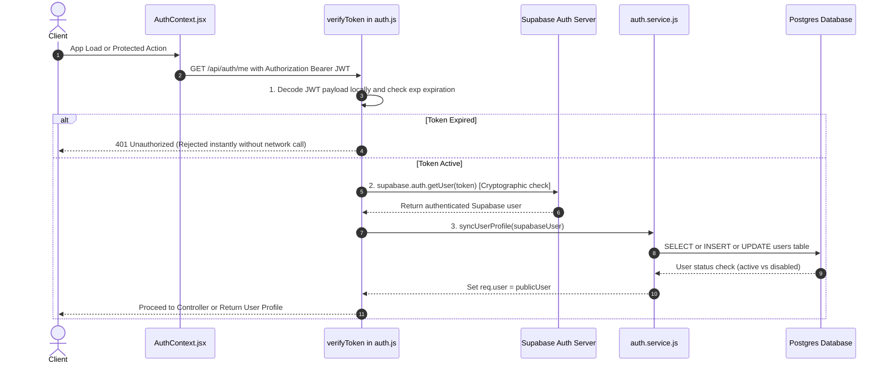
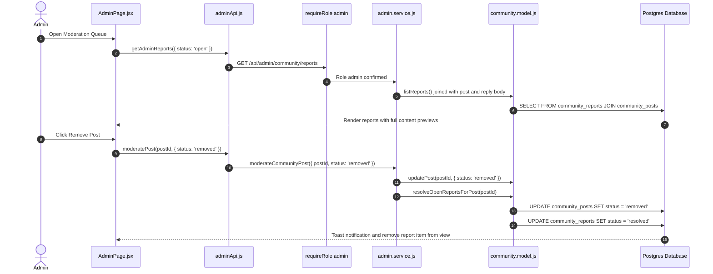

# Quang (QuangD300504) – Features & Frontend-to-Backend-to-Database Flows

This document details all features designed and implemented by **Nguyễn Quang Duy Quang (QuangD300504)** in the **AI-Study-Hub** project. For each feature, it traces the complete data path: **Frontend Component → API Call → Backend Route → Controller → Service → Model → Database Table(s)**.

---

## Summary of Feature Areas

1. **Community Hub Module** (Q&A, Discussions, Multi-Subject Posts, Threaded Replies, Voting, Reports & Moderation, Realtime Signals, Rich-Text Editor & Lightbox Zoom)
2. **Workspace Studio Module** (AI Flashcards with 3D flip & SRS practice mode, MCQ Quiz with letter mapping & custom explanations, Mind Map tree unwrapping)
3. **Authentication & Security Guardrails** (Supabase Auth integration, Local JWT expiration DoS protection, Role normalization & guards)
4. **Public Documents Catalog & Detail** (Public document catalog browsing, view count tracking, detail stats, ratings & comments)
5. **Admin Moderation & System Management** (Report moderation queue with full content preview, user status & storage limit controls, Subject CRUD, Admin overview analytics)

---

## Visual Architecture & Data Flow Diagrams

### 1. Overall System Architecture Diagram

### 2. Feature-by-Feature Sequence Flows

#### A. Community Hub - Create Post & Reply Flow

#### B. Workspace Studio - AI Flashcard & Quiz Generation Flow

#### C. Authentication & Fast DoS Guard Flow

#### D. Admin Moderation Flow

---

## 1. Community Hub Module

### 1.1 Community Feed Browsing
* **Description**: Allows users (public or authenticated) to view community posts filtered by tab (`hot`, `new`, `top`), post type (`question`, `discussion`), and subject code with pagination.
* **Frontend Source File**: `frontend/src/pages/CommunityPage.jsx`
* **Frontend API Call**: `getCommunityFeed(params)` in `frontend/src/services/communityApi.js`
* **HTTP Endpoint**: `GET /api/public/community/feed`
* **Backend Route File**: [public.routes.js](file:///d:/Document/SWP391/AI-Study-Hub/backend/src/routes/public.routes.js)
* **Backend Controller**: `communityController.getFeed` in [community.controller.js](file:///d:/Document/SWP391/AI-Study-Hub/backend/src/controllers/community.controller.js)
* **Backend Service**: `communityService.listPublicFeed` in [community.service.js](file:///d:/Document/SWP391/AI-Study-Hub/backend/src/services/community.service.js)
* **Backend Model**: `CommunityModel.listFeed` in [community.model.js](file:///d:/Document/SWP391/AI-Study-Hub/backend/src/models/community.model.js)
* **Database Tables Interacted With**:
  - `community_posts_feed_view` (SELECT - Optimized SQL view for feed items)
  - `community_posts` (SELECT - Post metadata, author details, view count)
  - `community_post_subjects` (SELECT - Multi-subject mappings joined with `subjects` table)
  - `community_votes` (SELECT - Aggregated vote score & user vote status check)
  - `community_replies` (SELECT - Reply counts per post)
  - `users` (SELECT - Author name, avatar, role)

---

### 1.2 Creating a Community Post
* **Description**: Authenticated users compose rich-text posts (using contenteditable editor), tag multiple subjects, attach optional study documents or chat sessions.
* **Frontend Source Files**: `frontend/src/pages/CommunityCreatePostPage.jsx`, `frontend/src/components/community/CommunityComposer.jsx`
* **Frontend API Call**: `createCommunityPost(payload)` in `frontend/src/services/communityApi.js`
* **HTTP Endpoint**: `POST /api/community/posts` (Guarded by `verifyToken`, `requireRole('user','admin')`)
* **Backend Route File**: [community.routes.js](file:///d:/Document/SWP391/AI-Study-Hub/backend/src/routes/community.routes.js)
* **Backend Controller**: `communityController.createPost` in [community.controller.js](file:///d:/Document/SWP391/AI-Study-Hub/backend/src/controllers/community.controller.js)
* **Backend Service**: `communityService.createPost` in [community.service.js](file:///d:/Document/SWP391/AI-Study-Hub/backend/src/services/community.service.js)
* **Backend Model**: `CommunityModel.createPost`, `CommunityModel.replacePostSubjects` in [community.model.js](file:///d:/Document/SWP391/AI-Study-Hub/backend/src/models/community.model.js)
* **Database Tables Interacted With**:
  - `community_posts` (INSERT - Insert post record with `user_id`, `post_type`, `title`, `body`, `document_id`, `chat_session_id`)
  - `community_post_subjects` (INSERT - Bulk insert subject ID associations for multi-subject tagging)

---

### 1.3 Viewing Post Thread & Details
* **Description**: Loads full post details, author bio, attached documents/chats, and threaded reply tree. Increments post view count with deduplication.
* **Frontend Source File**: `frontend/src/pages/CommunityPostDetailPage.jsx`
* **Frontend API Call**: `getCommunityPostById(id)` in `frontend/src/services/communityApi.js`
* **HTTP Endpoint**: `GET /api/public/community/posts/:id`
* **Backend Route File**: [public.routes.js](file:///d:/Document/SWP391/AI-Study-Hub/backend/src/routes/public.routes.js)
* **Backend Controller**: `communityController.getPostById` in [community.controller.js](file:///d:/Document/SWP391/AI-Study-Hub/backend/src/controllers/community.controller.js)
* **Backend Service**: `communityService.getPublicPostById` in [community.service.js](file:///d:/Document/SWP391/AI-Study-Hub/backend/src/services/community.service.js)
* **Backend Model**: `CommunityModel.findPostById`, `CommunityModel.listRepliesByPostId`, `CommunityModel.trackPostView` in [community.model.js](file:///d:/Document/SWP391/AI-Study-Hub/backend/src/models/community.model.js)
* **Database Tables Interacted With**:
  - `community_posts` (SELECT post record, UPDATE `view_count` via RPC deduplication)
  - `community_replies` (SELECT replies associated with post, ordered by `created_at`)
  - `community_votes` (SELECT check if current user upvoted post or replies)
  - `users` (SELECT post & reply author profiles)
  - `documents` & `chat_sessions` (SELECT details of attached study document or chat session)

---

### 1.4 Adding, Editing & Accepting Replies
* **Description**: Users add replies to posts (or nest replies under parent replies), edit their own replies, or post owners mark a reply as accepted solution.
* **Frontend Source Files**: `frontend/src/pages/CommunityPostDetailPage.jsx`, `frontend/src/components/community/CommunityThreadItem.jsx`
* **Frontend API Calls**: `createCommunityReply()`, `updateCommunityReply()`, `acceptCommunityReply()` in `frontend/src/services/communityApi.js`
* **HTTP Endpoints**:
  - Add Reply: `POST /api/community/posts/:id/replies`
  - Edit Reply: `PATCH /api/community/replies/:id`
  - Accept Solution: `POST /api/community/posts/:id/accept/:replyId`
* **Backend Route File**: [community.routes.js](file:///d:/Document/SWP391/AI-Study-Hub/backend/src/routes/community.routes.js)
* **Backend Controller**: `communityController.addReply`, `updateReply`, `acceptReply` in [community.controller.js](file:///d:/Document/SWP391/AI-Study-Hub/backend/src/controllers/community.controller.js)
* **Backend Service**: `communityService.addReply`, `updateReply`, `acceptReply` in [community.service.js](file:///d:/Document/SWP391/AI-Study-Hub/backend/src/services/community.service.js)
* **Backend Model**: `CommunityModel.createReply`, `CommunityModel.updateReply`, `CommunityModel.setAcceptedReply` in [community.model.js](file:///d:/Document/SWP391/AI-Study-Hub/backend/src/models/community.model.js)
* **Database Tables Interacted With**:
  - `community_replies` (INSERT new reply, UPDATE content/status, UPDATE `is_solution = true`)
  - `community_posts` (SELECT ownership validation, UPDATE `is_solved = true`)

---

### 1.5 Voting (Upvote Toggle)
* **Description**: Toggles upvotes on posts or replies.
* **Frontend Source File**: `frontend/src/pages/CommunityPostDetailPage.jsx`, `frontend/src/components/community/CommunityFeedRow.jsx`
* **Frontend API Calls**: `togglePostVote(id)`, `toggleReplyVote(id)` in `frontend/src/services/communityApi.js`
* **HTTP Endpoints**: `POST /api/community/posts/:id/vote`, `POST /api/community/replies/:id/vote`
* **Backend Route File**: [community.routes.js](file:///d:/Document/SWP391/AI-Study-Hub/backend/src/routes/community.routes.js)
* **Backend Controller**: `communityController.toggleVote` in [community.controller.js](file:///d:/Document/SWP391/AI-Study-Hub/backend/src/controllers/community.controller.js)
* **Backend Service**: `communityService.togglePostVote`, `communityService.toggleReplyVote` in [community.service.js](file:///d:/Document/SWP391/AI-Study-Hub/backend/src/services/community.service.js)
* **Backend Model**: `CommunityModel.findPostVote`, `CommunityModel.createVote`, `CommunityModel.deleteVote` in [community.model.js](file:///d:/Document/SWP391/AI-Study-Hub/backend/src/models/community.model.js)
* **Database Tables Interacted With**:
  - `community_votes` (SELECT check existing vote, INSERT new vote record, DELETE record on toggle off)

---

### 1.6 Submitting Reports
* **Description**: Users report posts or replies for moderation violations.
* **Frontend Source File**: `frontend/src/components/community/CommunityReportModal.jsx`
* **Frontend API Call**: `reportCommunityPost(id, reason, replyId)` in `frontend/src/services/communityApi.js`
* **HTTP Endpoint**: `POST /api/community/posts/:id/report`
* **Backend Route File**: [community.routes.js](file:///d:/Document/SWP391/AI-Study-Hub/backend/src/routes/community.routes.js)
* **Backend Controller**: `communityController.reportPost` in [community.controller.js](file:///d:/Document/SWP391/AI-Study-Hub/backend/src/controllers/community.controller.js)
* **Backend Service**: `communityService.reportPost` in [community.service.js](file:///d:/Document/SWP391/AI-Study-Hub/backend/src/services/community.service.js)
* **Backend Model**: `CommunityModel.findOpenPostReport`, `CommunityModel.createReport` in [community.model.js](file:///d:/Document/SWP391/AI-Study-Hub/backend/src/models/community.model.js)
* **Database Tables Interacted With**:
  - `community_reports` (SELECT deduplication check for existing open report, INSERT new report with status `'open'`)

---

## 2. Workspace Studio Module (Flashcards, Quiz, Mind Maps)

### 2.1 Generating AI Study Materials
* **Description**: Triggers AI generation of study materials (Flashcards, Quizzes, or Mind Maps) based on active document context and selected LLM model (Gemini or local Ollama).
* **Frontend Source File**: `frontend/src/components/workspace/WorkspaceStudioPanel.jsx`
* **Frontend API Call**: `generateStudyMaterial(docId, materialType, model)` in `frontend/src/services/aiApi.js`
* **HTTP Endpoint**: `POST /api/ai/materials/generate` (Guarded by `verifyToken`)
* **Backend Route File**: [ai.routes.js](file:///d:/Document/SWP391/AI-Study-Hub/backend/src/routes/ai.routes.js)
* **Backend Controller**: `aiController.generateMaterial` in [ai.controller.js](file:///d:/Document/SWP391/AI-Study-Hub/backend/src/controllers/ai.controller.js)
* **Backend Service**: `studyMaterialService.generateMaterial` in [study-material.service.js](file:///d:/Document/SWP391/AI-Study-Hub/backend/src/services/study-material.service.js)
  - Uses `aiUsageService.resolveModel(model)` to determine provider
  - Calls `geminiService.queryDocumentChunks` or `ollamaService.generateChat`
  - Performs Jaccard similarity deduplication for Flashcards
* **Backend Model**: `studyMaterialModel.create` in [study-material.model.js](file:///d:/Document/SWP391/AI-Study-Hub/backend/src/models/study-material.model.js)
* **Database Tables Interacted With**:
  - `study_materials` (INSERT - Persists generated JSON structured material: `document_id`, `material_type`, `title`, `content`)
  - `documents` (SELECT - Fetches extracted document text/metadata)
  - `document_chunks` (SELECT - Fetches vector/text chunks for prompt context building)
  - `ai_usage_logs` (INSERT - Records LLM prompt and completion token counts)

---

### 2.2 Loading & Deleting Previously Generated Materials
* **Description**: Loads existing flashcard decks, quizzes, or mind maps stored for a document, or deletes unwanted study material.
* **Frontend Source File**: `frontend/src/components/workspace/WorkspaceStudioPanel.jsx`
* **Frontend API Calls**: `getStudyMaterials(docId)`, `deleteStudyMaterial(id)` in `frontend/src/services/aiApi.js`
* **HTTP Endpoints**: `GET /api/ai/materials?docId=...`, `DELETE /api/ai/materials/:id`
* **Backend Route File**: [ai.routes.js](file:///d:/Document/SWP391/AI-Study-Hub/backend/src/routes/ai.routes.js)
* **Backend Controller**: `aiController.getMaterials`, `deleteMaterial` in [ai.controller.js](file:///d:/Document/SWP391/AI-Study-Hub/backend/src/controllers/ai.controller.js)
* **Backend Service**: `studyMaterialService.listByDocument`, `deleteMaterial` in [study-material.service.js](file:///d:/Document/SWP391/AI-Study-Hub/backend/src/services/study-material.service.js)
* **Backend Model**: `studyMaterialModel.listByDocumentId`, `deleteById` in [study-material.model.js](file:///d:/Document/SWP391/AI-Study-Hub/backend/src/models/study-material.model.js)
* **Database Tables Interacted With**:
  - `study_materials` (SELECT list materials by `document_id`, DELETE record by `id`)

---

## 3. Authentication & Security Guardrails

### 3.1 Supabase Auth & Local JWT Verification
* **Description**: Handles user login/signup via Supabase Auth and validates Bearer tokens on backend API requests. Includes a fast local JWT base64 expiration check to prevent token spam DoS attacks on external Supabase servers.
* **Frontend Source Files**: `frontend/src/contexts/AuthContext.jsx`, `frontend/src/services/authApi.js`, `frontend/src/pages/LoginPage.jsx`
* **Frontend API Call**: `authApi.getCurrentUser()` -> `GET /api/auth/me`
* **Backend Middleware**: `verifyToken` in [auth.js](file:///d:/Document/SWP391/AI-Study-Hub/backend/src/middleware/auth.js)
  - 1. Decodes JWT payload locally to verify `exp` expiration
  - 2. Calls `supabase.auth.getUser(token)`
  - 3. Calls `authService.syncUserProfile(supabaseUser)`
* **Backend Route File**: [auth.routes.js](file:///d:/Document/SWP391/AI-Study-Hub/backend/src/routes/auth.routes.js)
* **Backend Controller**: `authController.getMe` in [auth.controller.js](file:///d:/Document/SWP391/AI-Study-Hub/backend/src/controllers/auth.controller.js)
* **Backend Service**: `authService.syncUserProfile` in [auth.service.js](file:///d:/Document/SWP391/AI-Study-Hub/backend/src/services/auth.service.js)
* **Backend Model**: `userModel.findById`, `create` in [user.model.js](file:///d:/Document/SWP391/AI-Study-Hub/backend/src/models/user.model.js)
* **Database Tables Interacted With**:
  - `users` (SELECT user profile, INSERT on first login sync, UPDATE `last_login_at`, check `status !== 'disabled'`)
  - `user_preferences` (SELECT user theme/language settings)
  - `user_storage` (SELECT user storage limits and current usage)

---

## 4. Public Documents Catalog & Detail

### 4.1 Browsing & Searching Public Documents Catalog
* **Description**: Public document catalog with search, subject filtering, view count sorting, and pagination.
* **Frontend Source File**: `frontend/src/pages/PublicDocumentsCatalogPage.jsx`
* **Frontend API Call**: `getPublicDocuments(params)` in `frontend/src/services/documentApi.js`
* **HTTP Endpoint**: `GET /api/public/documents`
* **Backend Route File**: [public.routes.js](file:///d:/Document/SWP391/AI-Study-Hub/backend/src/routes/public.routes.js)
* **Backend Controller**: `publicController.searchPublicDocuments` in [public.controller.js](file:///d:/Document/SWP391/AI-Study-Hub/backend/src/controllers/public.controller.js)
* **Backend Service**: `publicService.searchPublicDocuments` in [public.service.js](file:///d:/Document/SWP391/AI-Study-Hub/backend/src/services/public.service.js)
* **Backend Model**: `documentModel.searchPublic` in [document.model.js](file:///d:/Document/SWP391/AI-Study-Hub/backend/src/models/document.model.js)
* **Database Tables Interacted With**:
  - `documents` (SELECT list where `is_public = true`, title search, view count sorting)
  - `subjects` (SELECT subject code & name)
  - `users` (SELECT uploader profile)

---

### 4.2 Public Document Details & Comments
* **Description**: Views public document metadata, AI overview, increments view count, fetches signed download URL, and lists/posts user ratings & comments.
* **Frontend Source File**: `frontend/src/pages/PublicDocumentDetailPage.jsx`
* **Frontend API Calls**: `getPublicDocumentById()`, `getPublicDocumentSignedUrl()`, `getDocumentComments()`, `createDocumentComment()` in `frontend/src/services/documentApi.js`
* **HTTP Endpoints**:
  - Details: `GET /api/public/documents/:id`
  - Signed Download URL: `GET /api/public/documents/:id/signed-url`
  - Comments: `GET /api/public/documents/:id/comments`, `POST /api/public/documents/:id/comments` (Auth required for POST)
* **Backend Route File**: [public.routes.js](file:///d:/Document/SWP391/AI-Study-Hub/backend/src/routes/public.routes.js)
* **Backend Controller**: `publicController.getPublicDocumentById`, `createDocumentComment` in [public.controller.js](file:///d:/Document/SWP391/AI-Study-Hub/backend/src/controllers/public.controller.js)
* **Backend Service**: `publicService.getPublicDocumentById`, `createDocumentComment` in [public.service.js](file:///d:/Document/SWP391/AI-Study-Hub/backend/src/services/public.service.js)
* **Backend Model**: `documentModel.findAccessibleById` in [document.model.js](file:///d:/Document/SWP391/AI-Study-Hub/backend/src/models/document.model.js), `documentCommentModel`
* **Database Tables Interacted With**:
  - `documents` (SELECT record where `is_public = true`, UPDATE `view_count` increment)
  - `document_comments` (SELECT list document comments, INSERT user rating/comment)
  - `users` (SELECT uploader and commenter user profiles)

---

## 5. Admin Moderation & System Management

### 5.1 Moderation Queue (Report Resolution & Content Takedowns)
* **Description**: Admin moderation dashboard displaying reported community posts and replies with full post/reply body preview, markdown rendering, direct post link context, and actions to resolve/dismiss reports or remove posts/replies.
* **Frontend Source File**: `frontend/src/pages/AdminPage.jsx` (Protected by `AdminRoute.jsx` for `role === 'admin'`)
* **Frontend API Calls**: `getAdminReports()`, `moderatePost()`, `moderateReply()`, `resolveReport()` in `frontend/src/services/adminApi.js`
* **HTTP Endpoints**:
  - List Reports: `GET /api/admin/community/reports`
  - Moderate Post: `PATCH /api/admin/community/posts/:id`
  - Moderate Reply: `PATCH /api/admin/community/replies/:id`
  - Resolve/Dismiss Report: `PATCH /api/admin/community/reports/:id`
* **Backend Route File**: [admin.routes.js](file:///d:/Document/SWP391/AI-Study-Hub/backend/src/routes/admin.routes.js)
* **Backend Controller**: `adminController.getCommunityReports`, `moderateCommunityPost`, `moderateCommunityReply`, `resolveCommunityReport` in [admin.controller.js](file:///d:/Document/SWP391/AI-Study-Hub/backend/src/controllers/admin.controller.js)
* **Backend Service**: `adminService.listCommunityReports`, `moderateCommunityPost`, `moderateCommunityReply`, `resolveCommunityReport` in [admin.service.js](file:///d:/Document/SWP391/AI-Study-Hub/backend/src/services/admin.service.js)
* **Backend Model**: `CommunityModel.listReports`, `CommunityModel.updatePost`, `CommunityModel.updateReply`, `CommunityModel.updateReport` in [community.model.js](file:///d:/Document/SWP391/AI-Study-Hub/backend/src/models/community.model.js)
* **Database Tables Interacted With**:
  - `community_reports` (SELECT open reports with joined reporter/post/reply, UPDATE `status = 'resolved' | 'dismissed'`)
  - `community_posts` (UPDATE `status = 'removed' | 'active'`)
  - `community_replies` (UPDATE `status = 'removed' | 'active'`)

---

### 5.2 User Management & Storage Quota Control
* **Description**: Admins view system users, toggle account status (`active` vs `disabled`), and adjust cloud storage quotas.
* **Frontend Source File**: `frontend/src/pages/AdminPage.jsx`
* **Frontend API Calls**: `getAdminUsers()`, `updateAdminUser()` in `frontend/src/services/adminApi.js`
* **HTTP Endpoints**: `GET /api/admin/users`, `PATCH /api/admin/users/:id`
* **Backend Route File**: [admin.routes.js](file:///d:/Document/SWP391/AI-Study-Hub/backend/src/routes/admin.routes.js)
* **Backend Controller**: `adminController.listUsers`, `updateUser` in [admin.controller.js](file:///d:/Document/SWP391/AI-Study-Hub/backend/src/controllers/admin.controller.js)
* **Backend Service**: `adminService.listUsers`, `updateUser` in [admin.service.js](file:///d:/Document/SWP391/AI-Study-Hub/backend/src/services/admin.service.js)
* **Backend Model**: `userModel.listAll`, `userModel.update` in [user.model.js](file:///d:/Document/SWP391/AI-Study-Hub/backend/src/models/user.model.js)
* **Database Tables Interacted With**:
  - `users` (SELECT all users, UPDATE status `active`/`disabled`)
  - `user_storage` (SELECT storage usage, UPDATE `storage_limit_bytes`)

---

### 5.3 Subject Management (CRUD)
* **Description**: Admin management of academic subjects (create, read, update, delete).
* **Frontend Source File**: `frontend/src/pages/AdminPage.jsx`
* **Frontend API Calls**: `getAdminSubjects()`, `createAdminSubject()`, `updateAdminSubject()`, `deleteAdminSubject()` in `frontend/src/services/adminApi.js`
* **HTTP Endpoints**: `GET/POST/PATCH/DELETE /api/admin/subjects`
* **Backend Route File**: [admin.routes.js](file:///d:/Document/SWP391/AI-Study-Hub/backend/src/routes/admin.routes.js)
* **Backend Controller**: `adminController` in [admin.controller.js](file:///d:/Document/SWP391/AI-Study-Hub/backend/src/controllers/admin.controller.js)
* **Backend Service**: `adminService` in [admin.service.js](file:///d:/Document/SWP391/AI-Study-Hub/backend/src/services/admin.service.js)
* **Backend Model**: `subjectModel` in [subject.model.js](file:///d:/Document/SWP391/AI-Study-Hub/backend/src/models/subject.model.js)
* **Database Tables Interacted With**:
  - `subjects` (SELECT, INSERT, UPDATE, DELETE subject records)
  - `documents` (SELECT check if documents are linked before subject deletion)

---

### 5.4 Admin Overview Dashboard Analytics
* **Description**: Returns system metrics and time-series data for total users, documents, community posts, and open moderation reports.
* **Frontend Source File**: `frontend/src/pages/AdminPage.jsx`
* **Frontend API Call**: `getAdminOverview()` in `frontend/src/services/adminApi.js`
* **HTTP Endpoint**: `GET /api/admin/overview`
* **Backend Route File**: [admin.routes.js](file:///d:/Document/SWP391/AI-Study-Hub/backend/src/routes/admin.routes.js)
* **Backend Controller**: `adminController.getOverview` in [admin.controller.js](file:///d:/Document/SWP391/AI-Study-Hub/backend/src/controllers/admin.controller.js)
* **Backend Service**: `adminService.getOverview` in [admin.service.js](file:///d:/Document/SWP391/AI-Study-Hub/backend/src/services/admin.service.js)
* **Database Tables Interacted With**:
  - `users` (SELECT count total users)
  - `documents` (SELECT count total documents & storage bytes used)
  - `community_posts` (SELECT count total posts)
  - `community_reports` (SELECT count open reports)

---

## Complete Database Mapping Matrix

| Table Name | Managed By Feature Area | Primary Operations | Key Columns Interacted With |
|---|---|---|---|
| `community_posts` | Community Hub, Admin | SELECT, INSERT, UPDATE, RPC | `id`, `user_id`, `post_type`, `title`, `body`, `document_id`, `chat_session_id`, `view_count`, `status`, `is_solved` |
| `community_post_subjects` | Community Hub | SELECT, INSERT, DELETE | `post_id`, `subject_id` |
| `community_replies` | Community Hub, Admin | SELECT, INSERT, UPDATE, DELETE | `id`, `post_id`, `user_id`, `parent_reply_id`, `body`, `is_solution`, `status` |
| `community_votes` | Community Hub | SELECT, INSERT, DELETE | `id`, `user_id`, `post_id`, `reply_id` |
| `community_reports` | Community Hub, Admin | SELECT, INSERT, UPDATE | `id`, `reporter_id`, `post_id`, `reply_id`, `reason`, `status`, `resolver_id` |
| `community_posts_feed_view` | Community Hub | SELECT | SQL View combining post score, reply count, and subject code |
| `community_user_stats` | Community Hub | SELECT | SQL View aggregating user activity stats |
| `study_materials` | Workspace Studio | SELECT, INSERT, DELETE | `id`, `document_id`, `material_type`, `title`, `content` |
| `documents` | Workspace Studio, Public Docs, Admin | SELECT, UPDATE | `id`, `user_id`, `title`, `extracted_text`, `is_public`, `view_count` |
| `document_chunks` | Workspace Studio | SELECT | `id`, `document_id`, `chunk_index`, `content` |
| `ai_usage_logs` | Workspace Studio | INSERT | `id`, `user_id`, `model`, `prompt_tokens`, `completion_tokens` |
| `document_comments` | Public Docs | SELECT, INSERT | `id`, `document_id`, `user_id`, `content`, `rating` |
| `users` | Auth, Admin | SELECT, INSERT, UPDATE | `id`, `email`, `full_name`, `avatar_url`, `role`, `status`, `last_login_at` |
| `user_preferences` | Auth | SELECT | `user_id`, `theme`, `language` |
| `user_storage` | Auth, Admin | SELECT, UPDATE | `user_id`, `used_bytes`, `storage_limit_bytes` |
| `subjects` | Public Docs, Admin | SELECT, INSERT, UPDATE, DELETE | `id`, `code`, `name`, `description` |

---
*Generated based on Git commit history (`git log --author="Quang"`) and codebase architecture inspection.*
