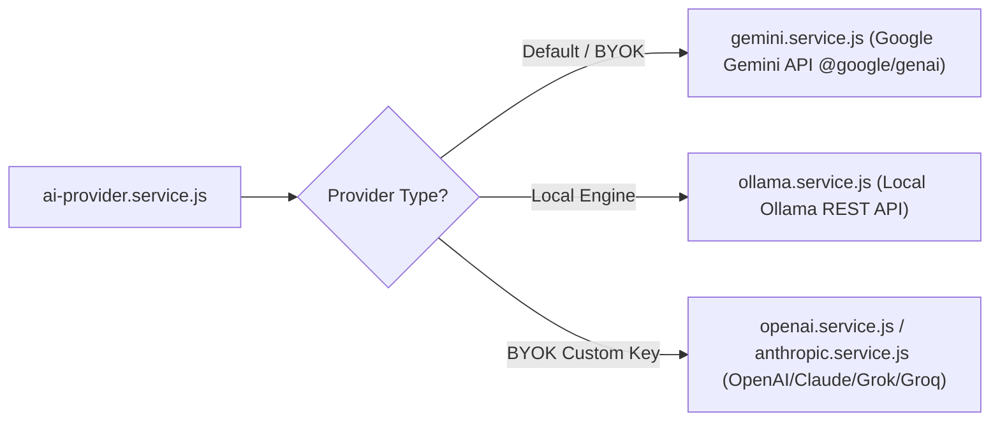
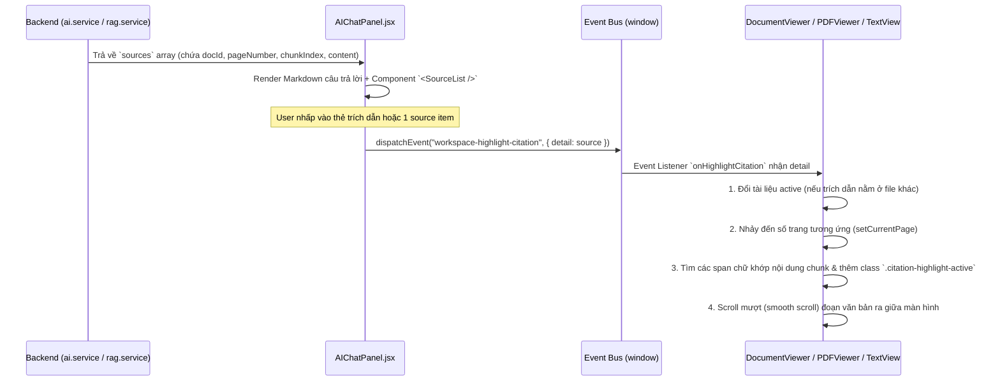
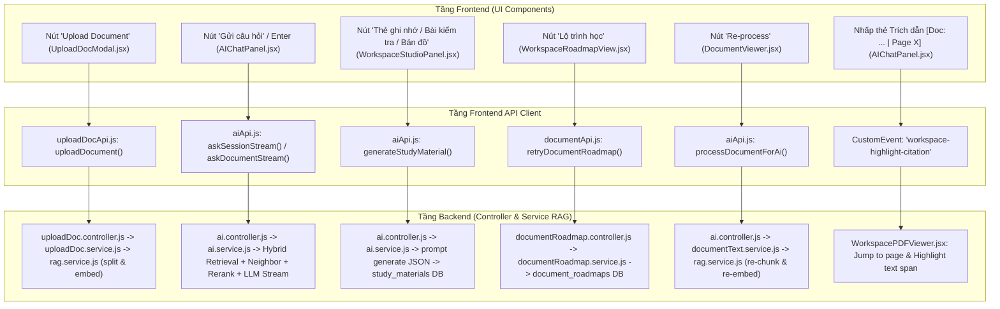

# TOÀN BỘ KIẾN TRÚC VÀ WORKFLOW RAG (RETRIEVAL-AUGMENTED GENERATION) TRONG SYSTEM

> **Tài liệu Audit Hệ thống RAG**  
> **Dự án**: AI-Study-Hub  
> **Mục đích**: Tổng hợp chi tiết quy trình xử lý dữ liệu RAG, từ Controller -> Service -> Model -> Database Query -> Chunking -> Embedding -> Hybrid Retrieval -> Neighbor Expansion -> Reranking -> Verification -> LLM Response.

---

## I. TỔNG QUAN LUỒNG CHẠY (END-TO-END WORKFLOW)

Hệ thống RAG xử lý theo 2 giai đoạn chính:

```mermaid
flowchart TD
    subgraph Phase1["Giai Đoạn 1: Nạp & Tiền Xử Lý Dữ Liệu (Ingestion Phase)"]
        A1[Client/Upload] --> B1[uploadDoc.controller.js]
        B1 --> C1[uploadDoc.service.js / document-text.service.js]
        C1 --> D1["rag.service.js: splitTextIntoChunks()"]
        D1 --> E1["embedding.service.js: embedChunks()"]
        E1 --> F1["document-chunk.model.js: replaceForDocument()"]
        F1 --> G1[Supabase DB: Table document_chunks]
    end

    subgraph Phase2["Giai Đoạn 2: Truy Vấn & Sinh Câu Trả Lời (Query & Generation Phase)"]
        A2[User Client] --> B2["ai.controller.js: askDocumentStream / askSessionStream"]
        B2 --> C2["ai.service.js: executeAskStream() / prepareAsk()"]
        C2 --> D2["chat-context.service.js: analyzeRequest() & resolveDocumentScope()"]
        D2 --> E2{"Intent Type?"}
        
        E2 -- Normal RAG --> F2["ai.service.js: retrieveChunksForQuestion() (Hybrid: Vector + Keyword)"]
        F2 --> G2["rag-neighbor.service.js: expandWithNeighborsSafe()"]
        G2 --> H2["rag-rerank.service.js: rerankAndPruneSafe()"]
        
        E2 -- Comparison RAG --> I2["rag-comparison.service.js: retrieveComparisonEvidence()"]
        E2 -- Overview RAG --> J2["ai.service.js: buildOverviewEvidence()"]
        
        H2 & I2 & J2 --> K2["rag.service.js: buildValidatedEvidence()"]
        K2 --> L2["verification.service.js: verifyEvidenceSafe()"]
        L2 --> M2["ai-provider.service.js: streamAnswer() (Gemini / Ollama)"]
        M2 --> N2[Client SSE Stream & Save DB]
    end
```



---

## II. CHI TIẾT CÁC MÔ-ĐUN, HAM VÀ CHỨC NĂNG

### 1. TẦNG CONTROLLER (TIẾP NHẬN YÊU CẦU HTTP)

#### File: `backend/src/controllers/ai.controller.js`
- `askDocument(req, res, next)`: Xử lý hỏi đáp đồng bộ trên 1 tài liệu đơn lẻ. Gọi `aiService.askDocument()`.
- `askDocumentStream(req, res)`: Xử lý hỏi đáp **streaming (SSE)** trên 1 tài liệu đơn lẻ. Thiết lập header `text/event-stream` và gọi `aiService.askDocumentStream()`.
- `askSession(req, res, next)`: Xử lý hỏi đáp đồng bộ trên một phiên Chat Session (chứa nhiều tài liệu/tệp đính kèm). Gọi `aiService.askSession()`.
- `askSessionStream(req, res)`: Xử lý hỏi đáp **streaming (SSE)** trên một phiên Chat Session. Thiết lập header SSE và gọi `aiService.askSessionStream()`.

#### File: `backend/src/controllers/uploadDoc.controller.js`
- `uploadDocument(req, res, next)`: Nhận file tải lên từ user, gọi `uploadDocService.processUploadedDocument()`.

---

### 2. TẦNG CHUNKING, EMBEDDING VÀ QUẢN LÝ TÀI LIỆU (INGESTION)

#### File: `backend/src/services/rag.service.js`
- `splitTextIntoChunks(text, metadata)`:
  - **Tác dụng**: Cắt toàn bộ văn bản của tài liệu thành các đoạn nhỏ (**Chunk**) hoàn chỉnh câu và từ.
  - **Cấu hình**: `CHUNK_SIZE = 1600` ký tự, `CHUNK_OVERLAP = 220` ký tự.
  - **Thuật toán căn chỉnh ranh giới sạch (Clean Boundary Snapping)**:
    - **`findCleanEnd(text, start, idealEnd)`**: Tìm điểm ngắt tự nhiên cho vị trí cuối chunk theo thứ tự ưu tiên: Paragraph break (`\n\n`) $\rightarrow$ Sentence break (`. `, `? `, `! `, `\n`) $\rightarrow$ Clause break (`; `, `: `) $\rightarrow$ Word space (` `). Nếu không tìm thấy trong cửa sổ ngắt, mở rộng nhẹ để không bao giờ ngắt ngang từ.
    - **`findCleanStart(text, candidateStart, prevStart, prevEnd)`**: Khi bắt đầu chunk tiếp theo bằng điểm overlap (`end - CHUNK_OVERLAP`), tự động dò tìm đầu câu tiếp theo gần nhất hoặc lùi lại đầu từ đầy đủ (Word boundary rewind), đảm bảo chunk **không bao giờ bị cụt mất từ ở đầu chunk** (tránh tình trạng bị cắt chữ như `"uirements"`, `"onyms"`, `"duct"`...).
  - **Metadata sinh ra**: Kèm `startChar`, `endChar`, `pageNumber`, `sectionHeading` (dùng `inferSectionHeading`), và `requirementIds` (dùng `extractRequirementIds` để tìm các mã yêu cầu như `REQ-01`, `UC-02`, `FR-03`).
- `tokenize(text)`: Tách văn bản thành danh sách từ (loại bỏ stop words).
- `rankRelevantChunks(question, chunks, limit)` & `retrieveRelevantChunks(...)`: Tìm kiếm chunk theo **từ khóa (BM25/TF-like keyword scoring)**.
- `buildValidatedEvidence(chunks, documentsById)`: Kiểm tra tính hợp lệ về quyền sở hữu dữ liệu (**Source ownership invariant**), ngăn chặn prompt injection hoặc rò rỉ dữ liệu giữa các tài liệu khác nhau.

#### File: `backend/src/services/embedding.service.js`
- `embedChunks(chunks)`:
  - **Tác dụng**: Tạo Vector Embedding cho danh sách các chunks văn bản.
  - **Model**: `text-embedding-004` (Google Gemini API), số chiều `768`.
  - **TaskType**: `RETRIEVAL_DOCUMENT`.
- `embedQuery(question)`:
  - **Tác dụng**: Tạo Vector Embedding cho câu hỏi của người dùng.
  - **TaskType**: `RETRIEVAL_QUERY`.

#### File: `backend/src/models/document-chunk.model.js`
- `replaceForDocument(docId, chunks)`: Xóa các chunks cũ của tài liệu trong DB và chèn hàng loạt các chunks mới cùng chuỗi Vector Literal `[x1, x2, ...]` vào bảng `document_chunks`.
- `matchByEmbedding({ docId, embedding, limit })`: Gọi Supabase RPC `match_document_chunks` (thực thi Cosine Similarity bằng `pgvector`) cho 1 tài liệu.
- `matchByEmbeddingAcrossDocuments({ docIds, embedding, limit })`: Gọi Supabase RPC `match_document_chunks_multi` để tìm kiếm Vector trên nhiều tài liệu cùng lúc.
- `findByDocumentIds(docIds)` / `findByIds(ids)`: Truy vấn danh sách chunks từ DB theo ID tài liệu hoặc ID chunk.
- `copyFromDocument(sourceDocId, targetDocId)`: Sao chép chunks và vectors đã tạo sẵn từ tài liệu nguồn sang tài liệu đích mà không cần gọi lại Embedding API.

---

### 3. TẦNG XỬ LÝ NGỮ CẢNH VÀ ĐIỀU HƯỚNG INTENT (CHAT CONTEXT)

#### File: `backend/src/services/chat-context.service.js`
- `analyzeRequest({ question, history, documents })`:
  - **Tác dụng**: Phân tích Intent (ý định) của câu hỏi.
  - **Phân loại Intent**: `comparison` (so sánh), `overview` (tóm tắt/tổng quan), `factual` (hỏi đáp thực tế), v.v.
  - **Trích xuất**: `retrievalQuery` (câu truy vấn tối ưu), `comparedDocumentIds` (danh sách ID tài liệu cần so sánh), `responseConstraints` (ràng buộc độ dài/định dạng).
- `resolveDocumentScope({ question, documents, primaryDocumentId, focusedDocumentId, intent })`:
  - **Tác dụng**: Xác định phạm vi tài liệu cần truy vấn: `general` (toàn bộ session), `explicit_single` (1 tài liệu được chỉ định/focus), `explicit_multi` (tập hợp tài liệu cụ thể).

---

### 4. TẦNG HYBRID RETRIEVAL & MỞ RỘNG (SEARCH, NEIGHBOR, RERANK)

#### A. Hybrid Retrieval (Vector + Keyword)
#### File: `backend/src/services/ai.service.js` -> `retrieveChunksForQuestion({ docIds, question, chunks, scopeType })`:
- **Bước 1**: Tìm kiếm bằng Keyword qua `ragService.retrieveRelevantChunks()`.
- **Bước 2**: Tìm kiếm bằng Vector Embedding qua `embeddingService.embedQuery()` và `documentChunkModel.matchByEmbedding AcrossDocuments()`.
- **Bước 3 (`mergeHybridChunks`)**: Trộn kết quả theo công thức:
  $$\text{Score} = 0.7 \times \text{VectorScore} + 0.3 \times \text{NormalizedKeywordScore}$$
- **Kết quả**: Trả về các **Seed Chunks** có điểm liên quan cao nhất.

---

#### B. Neighbor Chunk Expansion (Mở rộng Chunk lân cận)
#### File: `backend/src/services/rag-neighbor.service.js`
- `expandWithNeighborsSafe({ seedChunks, chunkPool, question, documentIds })`:
  - **Tác dụng**: Sau khi có các Seed Chunks, kiểm tra và lấy thêm chunk **ngay trước (`chunk_index - 1`)** và **ngay sau (`chunk_index + 1`)** trong CÙNG 1 tài liệu.
  - **Chỉ số Quality Gate (`isNeighborRelevant`)**: Neighbor chỉ được nhận nếu thỏa mãn 1 trong các điều kiện:
    1. Cùng Section Heading với Seed.
    2. Tiếp nối cấu trúc câu/danh sách (Seed kết thúc dở dang, Neighbor bắt đầu câu tiếp).
    3. Có trùng lặp từ khóa chính với Seed hoặc với câu hỏi.
  - **Giới hạn**: Tối đa 6 chunks tổng cộng, giữ trong ngân sách `MAX_CONTEXT_CHARS` (7000 ký tự).

---

#### C. Reranking & Pruning (Xếp hạng & Lọc nhiễu)
#### File: `backend/src/services/rag-rerank.service.js`
- `rerankAndPruneSafe({ chunks, question, scopeType, documentIds })`:
  - **Tác dụng**: Re-score toàn bộ Seed + Neighbor Chunks theo 8 tiêu chí quy tắc nghiệp vụ trước khi gửi LLM:
    - **+1.5** Vector Similarity.
    - **+0~3** Keyword Overlap.
    - **+0.4** Section Heading khớp với từ khóa câu hỏi.
    - **+0.3** Role Match (ví dụ: câu hỏi về "sinh viên", chunk về "sinh viên").
    - **+0.2** Topic Match (khớp cụm chủ đề: database, auth, storage...).
    - **-0.2** Neighbor Discount (chiết khấu nhẹ cho chunk lân cận).
    - **-0.8** Low-Information Penalty (trừ điểm nặng nếu chunk chứa ít thông tin, chỉ gồm số trang/mục lục).
    - **-0.3** Near-Duplicate Penalty (trừ điểm nếu trùng lặp ý với chunk điểm cao hơn).
  - **Kết quả**: Lọc lấy Top 4 - 6 chunks tối ưu nhất.

---

#### D. Comparison RAG (RAG So Sánh Đa Tài Liệu)
#### File: `backend/src/services/rag-comparison.service.js`
- `retrieveComparisonEvidence({ question, chunks, documents })`:
  - **Tác dụng**: Chuyên xử lý các câu hỏi so sánh giữa 2 hoặc nhiều tài liệu.
  - `expandComparisonQuery()`: Mở rộng từ khóa so sánh (ví dụ: database $\rightarrow$ mysql, postgresql, firebase, storage...).
  - `deriveStructureForChunks()`: Gắn kết nối cấu trúc giữa các tài liệu theo mã yêu cầu (`REQ-xx`) hoặc tiêu đề mục.
  - `selectProgressiveGroups()`: Nhóm các chunks tương quan từ các tài liệu khác nhau theo tiêu chuẩn: Requirement ID $\rightarrow$ Section Heading $\rightarrow$ Topic Overlap.
  - `buildAllowedDifferenceClaims()` & `buildGroundedProviderAnswer()`: Trích xuất các khẳng định khác biệt kỹ thuật rõ ràng để phòng tránh hallucination.

---

#### E. Overview RAG (RAG Tóm Tắt/Tổng Quan)
#### File: `backend/src/services/ai.service.js` -> `buildOverviewEvidence({ documents, overviewIntent })`:
- **Tác dụng**: Xử lý các câu hỏi dạng "Tóm tắt tài liệu này", "Nội dung chính là gì".
- Trích xuất bản tóm tắt đã tính toán sẵn trong bảng DB `document_overviews` (`documentOverviewModel.findReadyByDocumentIds`) kết hợp với các chunks đại diện.

---

### 5. TẦNG KIỂM CHỨNG & SINH CÂU TRẢ LỜI (VERIFICATION & LLM PROVIDER)

#### File: `backend/src/services/verification.service.js`
- `verifyEvidenceSafe({ question, requestContext, answerMode, chunks })`:
  - **Tác dụng**: Chạy một LLM Verifier nhanh sau khi lấy chunks để đánh giá xem ngữ cảnh tìm được có đủ bằng chứng trả lời câu hỏi thực tế hay không (tránh trả lời sai sự thật).

#### File: `backend/src/services/ai-provider.service.js`
- `streamAnswer({ provider, question, chunks, mode, model, history, ... })`:
  - **Tác dụng**: Ghép Prompt hoàn chỉnh (bao gồm System Instruction, Chat History, Chunks được đánh số trích dẫn `[Doc: ...]`, Response Constraints) và gọi LLM Engine.
  - Hỗ trợ cả **Google Gemini** (`gemini.service.js`) và **Local Ollama** (`ollama.service.js`).
  - Trả về dạng Async Generator để stream từng token về Controller thông qua SSE.
- `sanitizeAnswerCitationAttribution(answer)`: Làm sạch định dạng trích dẫn nguồn tài liệu trong câu trả lời.

#### File: `backend/src/services/ai-usage.service.js`
- `logGeminiRequest(...)`: Ghi log số lượng Token (`promptTokens`, `completionTokens`, `totalTokens`) và chi phí/lượt dùng vào DB cho từng user.

---

## III. QUY TRÌNH DI CHUYỂN DỮ LIỆU BẰNG MỘT VÍ DỤ CỤ THỂ

### Ví dụ: User bấm hỏi câu: *"Hệ thống đăng nhập hỗ trợ những phương thức nào?"* trên giao diện Chat Stream.

1. **`ai.controller.js`**:
   - Hàm `askSessionStream(req, res)` tiếp nhận HTTP POST request `/api/ai/sessions/:sessionId/ask-stream`.
   - Khởi tạo header SSE (`text/event-stream`), định nghĩa callback `sendEvent(event, data)`.
   - Gọi `aiService.askSessionStream({ sessionId, userId, question, sendEvent })`.

2. **`ai.service.js`**:
   - `askSessionStream` gọi `executeAskStream()`, trong đó gọi `prepareAsk()`.
   - `prepareAsk()` làm sạch câu hỏi (`cleanQuestion`), lấy danh sách tài liệu trong Session qua `resolveAskScope()`.
   - Lưu tin nhắn của User vào DB bằng `chatModel.addMessage(sessionId, 'user', ...)`.

3. **`chat-context.service.js`**:
   - `analyzeRequest()` phân tích câu hỏi: Intent là `factual`, `retrievalQuery` = `"Hệ thống đăng nhập hỗ trợ những phương thức nào"`.
   - `resolveDocumentScope()` xác định scope là `general` (tìm kiếm trên các tài liệu hợp lệ trong session).

4. **`ai.service.js` -> Load Chunks**:
   - `loadSessionChunks()` truy vấn tất cả chunks của các tài liệu trong session từ DB qua `documentChunkModel.findByDocumentIds()`.

5. **`ai.service.js` -> Hybrid Retrieval**:
   - Gọi `retrieveChunksForQuestion()`:
     - `ragService.retrieveRelevantChunks()`: Tokenize câu hỏi $\rightarrow$ lấy từ khóa `["đăng", "nhập", "hỗ", "trợ", "phương", "thức"]` $\rightarrow$ chấm điểm BM25/keyword trên danh sách chunks.
     - `embeddingService.embedQuery()`: Gọi Gemini API lấy Vector 768 chiều của câu hỏi.
     - `documentChunkModel.matchByEmbeddingAcrossDocuments()`: Gọi Supabase RPC `match_document_chunks_multi` để thực hiện Cosine Distance trên DB.
     - `mergeHybridChunks()`: Trộn điểm `0.7 * VectorScore + 0.3 * KeywordScore` $\rightarrow$ thu được các Seed Chunks.

6. **`rag-neighbor.service.js` -> Neighbor Expansion**:
   - Gọi `expandWithNeighborsSafe()`: Với mỗi Seed Chunk, kiểm tra chunk trước (`index-1`) và chunk sau (`index+1`). Lấy thêm chunk lân cận nếu nó nối tiếp câu hoặc cùng tiêu đề mục.

7. **`rag-rerank.service.js` -> Reranking & Pruning**:
   - Gọi `rerankAndPruneSafe()`: Tính lại điểm số tổng hợp (Vector + Keyword + Heading + Role/Topic Match - Neighbor Discount - Low Info Penalty).
   - Sắp xếp giảm dần và lấy Top 4 - 6 chunks chất lượng nhất, kiểm soát dưới 7000 ký tự.

8. **`rag.service.js` -> Source Ownership Validation**:
   - Gọi `buildValidatedEvidence()`: Kiểm tra khớp ID tài liệu, tạo đối tượng `sources` trích dẫn chính xác.

9. **`verification.service.js` -> Evidence Verification**:
   - Gọi `verifyEvidenceSafe()` để kiểm tra nhanh mức độ tin cậy của dữ liệu trích xuất.

10. **`ai-provider.service.js` -> LLM Stream Generation**:
    - Gọi `streamAnswer()`. Tạo Prompt chuẩn hóa chứa Ngữ cảnh Chunks + Lich sử trò chuyện.
    - Gọi Gemini Stream API (`gemini.service.js`). Vừa nhận token từ API vừa đẩy qua SSE `sendEvent('token', { text })` về Frontend.

11. **Lưu DB & Hoàn tất**:
    - Sau khi stream xong câu trả lời, `chatModel.addMessage(sessionId, 'assistant', answer, metadata)` được gọi để lưu tin nhắn AI kèm danh sách `sources` trích dẫn.
    - `aiUsageService.logGeminiRequest()` ghi nhận số token đã tiêu tốn.
    - Kết thúc SSE stream với `sendEvent('done', ...)`.

---

## IV. BẢNG TỔNG HỢP CÁC FILE VÀ HÀM CỐT LÕI

| Tầng / Mô-đun | File Cốt Lõi | Hàm Chính | Tác Dụng Ngắn Gọn |
| :--- | :--- | :--- | :--- |
| **Controller** | `ai.controller.js` | `askDocumentStream`, `askSessionStream` | Nhận request HTTP/SSE stream từ client, thiết lập SSE header và đẩy stream. |
| **Controller** | `uploadDoc.controller.js` | `uploadDocument` | Nhận file nạp từ user để bắt đầu quy trình trích xuất và chunking. |
| **Ingestion / Chunking** | `rag.service.js` | `splitTextIntoChunks` | Cắt văn bản thành chunks (1600 chars, overlap 220 chars), trích xuất heading & REQ IDs. |
| **Ingestion / Chunking** | `rag.service.js` | `buildValidatedEvidence` | Validation kiểm tra tính hợp lệ về quyền sở hữu tài liệu (chống rò rỉ dữ liệu). |
| **Embedding** | `embedding.service.js` | `embedChunks`, `embedQuery` | Gọi Gemini Embedding API (`text-embedding-004`, 768 dims) cho Chunks hoặc Query. |
| **Database / Model** | `document-chunk.model.js` | `replaceForDocument`, `matchByEmbeddingAcrossDocuments` | Lưu/Xóa chunks trong Supabase DB; gọi Supabase RPC thực thi Vector Similarity search. |
| **Context Analysis** | `chat-context.service.js` | `analyzeRequest`, `resolveDocumentScope` | Phân tích Intent câu hỏi (comparison, overview, factual) và thu hẹp phạm vi tài liệu. |
| **Hybrid Retrieval** | `ai.service.js` | `retrieveChunksForQuestion`, `mergeHybridChunks` | Kết hợp Vector Search (trọng số 0.7) và Keyword Search (trọng số 0.3). |
| **Neighbor Expansion** | `rag-neighbor.service.js` | `expandWithNeighborsSafe`, `isNeighborRelevant` | Mở rộng lấy thêm chunk liền trước/sau trong cùng tài liệu dựa trên Quality Gate. |
| **Rerank & Pruning** | `rag-rerank.service.js` | `rerankAndPruneSafe`, `scoreChunk` | Re-score chunks theo 8 tiêu chí (Topic, Role, Low-info...) và lọc lấy Top 4-6 chunks tốt nhất. |
| **Comparison RAG** | `rag-comparison.service.js` | `retrieveComparisonEvidence` | Căn chỉnh các chunks tương đồng giữa 2+ tài liệu theo REQ ID / Section để so sánh. |
| **Overview RAG** | `ai.service.js` | `buildOverviewEvidence` | Lấy dữ liệu tóm tắt tài liệu đã tính sẵn từ bảng `document_overviews`. |
| **Verification** | `verification.service.js` | `verifyEvidenceSafe` | Gọi LLM Verifier kiểm chứng tính đầy đủ của chứng cứ trước khi sinh câu trả lời. |
| **LLM Provider** | `ai-provider.service.js` | `streamAnswer`, `sanitizeAnswerCitationAttribution` | Dựng prompt hoàn chỉnh, gọi Gemini/Ollama stream câu trả lời và chuẩn hóa trích dẫn. |
| **Usage Tracking** | `aiUsageService.js` | `logGeminiRequest` | Ghi log token tiêu tốn (promptTokens, completionTokens) vào database. |

---

## V. XỬ LÝ GỌI API AI BÊN NGOÀI (EXTERNAL PROVIDERS & BYOK)

Hệ thống hỗ trợ đa mô hình AI (Google Gemini, Local Ollama, OpenAI, Anthropic, Grok, Groq) thông qua mô-đun trung gian `ai-provider.service.js`:



1. **Google Gemini API (`gemini.service.js`)**:
   - Sử dụng thư viện chính thức `@google/genai`.
   - Các model hỗ trợ: `gemini-1.5-flash` (mặc định), `gemini-1.5-pro`, `gemini-2.0-flash`.
   - Hàm `streamDocumentChunks()` thực thi `ai.models.generateContentStream()` để stream câu trả lời token theo từng chunk.
2. **Local Ollama API (`ollama.service.js`)**:
   - Gọi trực tiếp REST API tới instance Ollama địa phương (`http://localhost:11434/api/chat`).
   - Hỗ trợ các model chạy offline (Llama 3, Qwen 2.5, Mistral...).
   - Bổ sung Prompt Constraint ép trả lời 100% bằng tiếng Việt khi dùng Ollama.
3. **BYOK (Bring Your Own Key)**:
   - Cho phép người dùng nhập API Key cá nhân (OpenAI, Anthropic, Grok, Groq, Gemini) lưu trong DB.
   - Hàm `resolveUserKey()` lấy và giải mã khóa AES (`crypto.utils.js`) trong bộ nhớ cho riêng request đó.

---

## VI. LUỒNG TRÍCH DẪN (CITATION), HIGHLIGHT & ĐIỀU HƯỚNG TÀI LIỆU (NAVIGATION)



### 1. Backend Đóng Gói Trích Dẫn (`sources`)
Hàm `ragService.buildValidatedEvidence()` tạo danh sách `sources` với cấu trúc:
```json
{
  "id": 101,
  "documentId": 12,
  "documentTitle": "SRS_Specification.pdf",
  "chunkIndex": 3,
  "pageStart": 5,
  "pageEnd": 5,
  "content": "Nội dung trích đoạn văn bản...",
  "score": 0.85
}
```
Danh sách `sources` này được gửi về Frontend trong SSE `done` payload và lưu trữ lâu dài trong cột `metadata.sources` của bảng `chat_messages`.

### 2. Frontend Render Trích Dẫn (`AIChatPanel.jsx`)
- **Trong câu trả lời AI**: Các mã trích dẫn dạng `[Doc: SRS_Specification.pdf | Page 5]` được tự động bắt regex và render thành thẻ bấm.
- **Component `<SourceList />`**: Hiển thị danh sách các nguồn được dùng bên dưới câu trả lời, phân nhóm theo tài liệu, hiển thị % relevance badge và trích đoạn văn bản.

### 3. Điều Hướng & Tô Sáng Visual (Highlight & Jump to Page)
Khi người dùng nhấp vào trích dẫn:
1. **Phát Event**: `AIChatPanel.jsx` phát một Browser Custom Event:
   ```javascript
   window.dispatchEvent(new CustomEvent("workspace-highlight-citation", {
     detail: { documentId, pageNumber, chunkIndex, content }
   }));
   ```
2. **Lắng Nghe & Xử Lý (`WorkspacePDFViewer.jsx` / `WorkspaceTextView.jsx`)**:
   - **Tự động chuyển tài liệu**: Nếu trích dẫn thuộc tài liệu khác tài liệu đang mở, Viewer tự chuyển sang tài liệu đó.
   - **Nhảy trang**: Gọi `setCurrentPage(pageNumber)` để PDF Viewer nhảy trực tiếp đến trang chứa bằng chứng.
   - **Tô sáng chữ**: Tìm các thẻ span trong PDF Text Layer khớp với `content`, gắn class CSS `.citation-highlight-active` (hiệu ứng nền màu vàng/xanh neon phát sáng).
   - **Cuộn mượt**: Gọi `scrollIntoView({ behavior: 'smooth', block: 'center' })` đưa vị trí trích dẫn ra chính giữa tầm mắt người dùng.

---

## VII. BẢNG ÁNH XẠ THAO TÁC NÚT BẤM FRONTEND (FE) $\rightarrow$ BACKEND CONTROLLER $\rightarrow$ SERVICE & RAG PIPELINE

Dưới đây là sơ đồ và bảng ánh xạ chi tiết từng nút bấm / hành động người dùng trên giao diện Frontend (FE), hàm API được gọi, Endpoint backend, Controller, Service và toàn bộ luồng RAG tương ứng:



### Bảng Ánh Xạ Chi Tiết Thao Tác UI Frontend $\rightarrow$ Backend RAG

| Nút Bấm / Hành Động FE | Component Frontend | File API Client (FE) | HTTP Endpoint & Controller Backend | Service Backend & Luồng Xử Lý RAG |
| :--- | :--- | :--- | :--- | :--- |
| **1. Tải lên tài liệu mới**<br>*(Nút "Upload Document" trong Modal)* | [`UploadDocModal.jsx`](file:///c:/QUOC%20DAT/STUDY/SWP/AI-Study-Hub/frontend/src/pages/UploadDocModal.jsx) | `uploadDocApi.js`<br>`uploadDocument()` | `POST /api/upload-doc`<br>$\rightarrow$ `uploadDoc.controller.js`<br>`uploadDocument()` | `uploadDoc.service.js` $\rightarrow$ `documentText.service.js` (trích xuất văn bản) $\rightarrow$ `rag.service.js` (`splitTextIntoChunks`) $\rightarrow$ `embedding.service.js` (`embedChunks` - 768 dims) $\rightarrow$ `documentChunk.model.js` (`replaceForDocument` lưu Supabase vector DB). |
| **2. Gửi câu hỏi Chat RAG**<br>*(Nút "Send Question" / phím Enter)* | [`AIChatPanel.jsx`](file:///c:/QUOC%20DAT/STUDY/SWP/AI-Study-Hub/frontend/src/components/workspace/AIChatPanel.jsx) | `aiApi.js`<br>`askSessionStream()` hoặc `askDocumentStream()` | `POST /api/ai/sessions/:id/ask-stream`<br>$\rightarrow$ `ai.controller.js`<br>`askSessionStream()` | `ai.service.js` (`executeAskStream`) $\rightarrow$ `chatContextService.analyzeRequest()` (phân tích intent) $\rightarrow$ `retrieveChunksForQuestion()` (Hybrid Search: 0.7 Vector + 0.3 Keyword) $\rightarrow$ `ragNeighborService` (mở rộng chunk lân cận) $\rightarrow$ `ragRerankService` (Rerank Top 4-6) $\rightarrow$ `verificationService` (kiểm chứng bằng chứng) $\rightarrow$ `aiProviderService` (stream LLM SSE token). |
| **3. Tạo Học liệu AI**<br>*(Thẻ "Thẻ ghi nhớ", "Bài kiểm tra", "Bản đồ tư duy")* | [`WorkspaceStudioPanel.jsx`](file:///c:/QUOC%20DAT/STUDY/SWP/AI-Study-Hub/frontend/src/components/workspace/WorkspaceStudioPanel.jsx) | `aiApi.js`<br>`generateStudyMaterial()` | `POST /api/ai/documents/:id/study-materials`<br>$\rightarrow$ `ai.controller.js`<br>`generateStudyMaterial()` | `ai.service.js` $\rightarrow$ Đọc chunks của tài liệu qua `documentChunk.model` $\rightarrow$ Tạo Prompt định dạng JSON (Flashcard/Quiz) $\rightarrow$ `aiProviderService.generateContent()` $\rightarrow$ Parse kết quả JSON $\rightarrow$ Lưu vào bảng `study_materials`. |
| **4. Tạo Lộ trình học AI**<br>*(Tab "Lộ trình học" / Nút "Tạo lộ trình")* | [`WorkspaceRoadmapView.jsx`](file:///c:/QUOC%20DAT/STUDY/SWP/AI-Study-Hub/frontend/src/components/workspace/WorkspaceRoadmapView.jsx) | `documentApi.js`<br>`retryDocumentRoadmap()` | `POST /api/documents/:id/roadmap/retry`<br>$\rightarrow$ `documentRoadmap.controller.js`<br>`retryRoadmap()` | `documentRoadmap.service.js` $\rightarrow$ `generateRoadmapForDocument()` $\rightarrow$ Đọc văn bản trích xuất $\rightarrow$ Chia thành các phần mục cấu trúc $\rightarrow$ Gọi `aiProviderService` $\rightarrow$ Lưu cây lộ trình vào bảng `document_roadmaps`. |
| **5. Xử lý lại tài liệu (Re-process)**<br>*(Nút "Re-process" trên thanh công cụ)* | [`DocumentViewer.jsx`](file:///c:/QUOC%20DAT/STUDY/SWP/AI-Study-Hub/frontend/src/components/workspace/DocumentViewer.jsx) | `aiApi.js`<br>`processDocumentForAi()` | `POST /api/ai/documents/:id/process`<br>$\rightarrow$ `ai.controller.js`<br>`processDocument()` | `documentText.service.js` (trích xuất lại text từ PDF/DOCX) $\rightarrow$ `rag.service.js` (`splitTextIntoChunks`) $\rightarrow$ `embedding.service.js` (`embedChunks`) $\rightarrow$ Cập nhật lại các vectors mới vào Supabase DB. |
| **6. Xem tóm tắt tài liệu (Overview)**<br>*(Khi mở tài liệu hoặc chuyển tab Tóm tắt)* | [`WorkspaceStudioPanel.jsx`](file:///c:/QUOC%20DAT/STUDY/SWP/AI-Study-Hub/frontend/src/components/workspace/WorkspaceStudioPanel.jsx) | `documentOverviewApi.js`<br>`getDocumentOverview()` | `GET /api/documents/:id/overview`<br>$\rightarrow$ `documentOverview.controller.js`<br>`getOverview()` | `documentOverview.service.js` $\rightarrow$ Kiểm tra cache DB `document_overviews`. Nếu chưa có: `generateOverviewForDocument()` đọc chunks đại diện $\rightarrow$ Gọi LLM tổng hợp Tóm tắt & Key Takeaways $\rightarrow$ Lưu DB. |
| **7. Nhấp trích dẫn nguồn bằng chứng**<br>*(Thẻ `[Doc: ... \| Page X]` hoặc danh sách Source)* | [`AIChatPanel.jsx`](file:///c:/QUOC%20DAT/STUDY/SWP/AI-Study-Hub/frontend/src/components/workspace/AIChatPanel.jsx) | Event Bus:<br>`window.dispatchEvent("workspace-highlight-citation")` | *(Thao tác hoàn toàn trên Frontend Client)* | `WorkspacePDFViewer.jsx` / `WorkspaceTextView.jsx` lắng nghe event $\rightarrow$ Tự động chuyển tài liệu active $\rightarrow$ Nhảy số trang (`setCurrentPage`) $\rightarrow$ Bôi sáng chữ đoạn văn bản bằng class `.citation-highlight-active` $\rightarrow$ Cuộn mượt (smooth scroll) ra giữa màn hình. |


